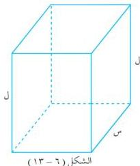

الوحدة السادسة

# ولحل المسائل التطبيقية على القيم القصوى يمكن اتباع الخطوات التالية :

١) اقرأ المسألة وحدد المتغيرات ، وارسم شكلاً تخطيطياً للمسألة .
٢) حدد المتغير المطلوب إيجاد قيمته القصوى وكتابة المعادلة التي تربط هذا المتغير بالمتغيرات الأخرى .
٣) كتابة المتغير المطلوب إيجاد قيمته القصوى كدالة في متغير واحد بدلالة البيانات المعطاة في المسألة .
٤) حدد مجال الدالة الناتجة ( إن أمكن ) .
٥) استخدم المعلومات التي سبق دراستها في تحديد القيمة القصوى المطلوبة .

# مثال (٦ - ٤١)

يُراد صنع مستطيل من سلك طوله ٢٠ سم ، أوجد بُعدي هذا المستطيل بحيث تكون مساحته أكبر ما يمكن .

# الحل :

نفرض أن عرض المستطيل = س سم
∴ طول المستطيل = ( ١٠ - س ) سم

فتكون : مساحة المستطيل = ( ١٠ - س ) × س = ١٠ س - س²

ولإيجاد النقطة الحرجة نجد أن :

د (س) = ١٠ - ٢ س = ٠
س = ٥

وبالتالي فإن : د (٥) = ٢٥ ، د (٠) = ٠ ، د (١٠) = ٠

∴ طول المستطيل = ٥ سم ، وعرضه = ٥ سم لكي تكون مساحة المستطيل أكبر ما يمكن .

# مثال (٦ - ٤٢)

متوازي مستطيلات قاعدته مربع طول ضلعه = س سم ،

ومجموع أطوال أحرفه تساوي ٣٠٠ سم .

أثبت أن حجمه يساوي س² (٧٥ - ٢) ، ثم أوجد

أبعاد متوازي المستطيلات عندما يكون حجمه أكبر ما يمكن .

# الحل :

نفرض أن حجم متوازي المستطيلات ح = س² ل (١)...

[ انظر الشكل (٦ - ١٣) ] .

وللتعبير عن ل بدلالة س نستخدم المعادلة :

١٩٨

http://www.e-learning-moe.edu.ye/