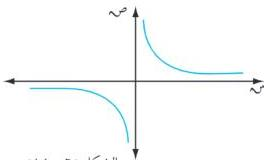

الوحدة السادسة

[٥] عددان مجموعهما ١٦ ، أوجد العددين إذا كان مجموع مربعيهما أصغر ما يمكن .

[٦] أوجد القيم القصوى لكل من الدوال التالية :

أ) ص = س² + ٤ س + ٦ .
ب) ص = س (س - ١)² .
ج) ص = س² / (س - ١) ، س = ١ .
د) ص = س | س - ٤ | .

[٧] إذا كانت د(س) = س³ - ٣ س² + ١ . أوجد فترات التقعر لمنحنى الدالة للأعلى وللأسفل ، ونقاط الانعطاف .

[٨] استخدم المشتقة الثانية في إيجاد القيم القصوى ونقاط الانعطاف لمنحنى الدالة

د(س) = س⁴ - ٢ س² موضحاً فترات التقعر نحو الأعلى والأسفل لمنحنى الدالة .

[٩] إذا كانت د(س) = ١/٣ س³ - ٣ س² + ٨ س . أوجد فترات التقعر للأعلى وللأسفل ونقاط الانقلاب .

[١٠] أوجد قيم كل من t ، ب بحيث تكون النقطة (١ ، ٣) نقطة انعطاف للمنحنى ص = t س³ + ب س² .

[١١] ارسم شكلاً لبيان منحنى الدالة د في الفترة [١ ، ٣] بدلالة المعلومات التالية :

د(١) = ٠ ، د(٣) = ٤ ، د(س) < ٠ ، v س ≥ [١ ، ٣] ، د(س) < ٠ ، v س ≥ [١ ، ٣]

[١٢] ارسم منحنى الدالة د(س) = جا ٣ س في الفترة [ ٠ ، ٢ / ٣ ] .

## دراسة تغيير الدالة

٦ - ٩

الفروع اللانهائية :

تعريف (٦ - ٣)

نقول أن للدالة د فرعاً لانهائياً إذا كان من الممكن أن يسعى أحد المتغيرين إلى اللانهائية (الموجبة ، أو السالبة ) ، أي إذا حوت مجموعة تعريف هذه الدالة أو مداها فترة من الشكل [∞ ، t] أو من الشكل [t - ∞ ، t] .

فمثلاً : إذا كانت الدالة د(س) = ١/س تلاحظ أن :

م.ت = ح* = [∞ ، ∞ ، ∞ ، ∞ ، ∞ ، ∞ ، ∞ ، ∞ ، ∞ ، ∞ ، ∞ ، ∞ ، ∞ ، ∞ ، ∞ ، ∞ ، ∞ ، ∞ ، ∞ ، ∞ ، ∞ ، ∞ ، ∞ ، ∞ ، ∞ ، ∞ ، ∞ ، ∞ ، ∞ ، ∞ ، ∞ ، ∞ ، ∞ ، ∞ ، ∞ ، ∞ ، ∞ ، ∞ ، ∞ ، ∞ ، ∞ ، ∞ ، ∞ ، ∞ ، ∞ ، ∞ ، ∞ ، ∞ ، ∞ ، ∞

أي أن مجموعة تعريفها تحتوي على فرعان لانهائيان .

نهياً د(س) = ∞ + ∞ ،

نهياً د(س) = ∞ - ∞ ، أي أن مدى

الدالة يحتوي أيضاً على فرعان لانهائيان . وبالتالي

فإن للدالة د أربعة فروع لانهائية كما في الشكل (٦ - ١٤) .

الشكل (٦ - ١٤)

٢٠٠

http://www.e-learning-moe.edu.ye/