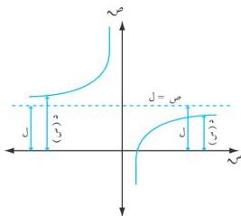

التفاصيل

إما إذا كانت الدالة $د (س) = \sqrt{4} - س^2$ ، فإن مجموعة تعريفها $[2, 2]$ ومداها أيضاً $[2, 0]$ ، وبالتالي فإن هذه الدالة ليس لها فروع لانهائية .

# المستقيمات المقاربة :

إذا رمزنا لبيان الدالة $ص = د (س)$ بالرمز $ك$ ، وكانت مجموعة تعريفها من الشكل $[\infty, t]$ ، أو $[-\infty, t]$ ورمزنا لبيان المستقيم الذي معادلته $ص = t س + ب$ بالرمز $ل$ ، نقول أن :  
ص = $t س + ب$ مستقيماً مقارباً إذا كان $|ك - ل| \leq 0$ عندما $س \leq \infty$ .  
أي أن : $س \leq \infty$ $د (س) - ص = 0$ .  
يمكن تصنيف المستقيمات المقاربة على النحو التالي :  
١- المستقيم المقارب الأفقي (الموازي محور السينات) :

# تعريف (٦ - ٤)

إذا كانت مجموعة تعريف الدالة $ص = د (س)$ من الشكل $[t, \infty]$ ، أو $[-\infty, t]$ ، وكانت $س \leq \infty$ $د (س) = ل \supseteq \infty$ ؛ فإن المستقيم $ص = ل$ مستقيم مقارب أفقي موازي محور السينات .

# ملاحظات على التعريف :

1. ١) البعد بين أي نقطة على منحنى الدالة والمستقيم المقارب هو $|د (س) - ل|$ .
2. ٢) عندما $د (س) - ل > 0$ يكون منحنى الدالة أسفل المستقيم المقارب ، وعندما $د (س) - ل > 0$ يكون منحنى الدالة أعلى المستقيم المقارب ، كما في الشكل (٦ - ١٥) .

الشكل (٦ - ١٥)

٢٠١

http://www.e-learning-moe.edu.ye/