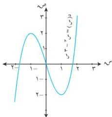

التفاصيل

الشكل (٦-١٧)

٦) نلخص ما سبق في الجدول التالي :

جدول (٦-٩)

|  س | +∞ | ١ | ٠ | ١-∞ | ∞-  |
| --- | --- | --- | --- | --- | --- |
|  د(س) | + | ٠ | - | - | +  |
|  د(س) | + | ٠ | + | ٠ | -  |
|  د(س) | +∞ | ٢- | ٠ | ٢ | ∞-  |
|   |  | (٢-١) | (٠-٠) | (٢-١) |   |
|   |  | صغرى | انعطاف | عظمى |   |

٧) نرسم بيان الدالة كما في الشكل (٦-١٧) .

# مثال (٦-٤٥)

ادرس تغيرات الدالة د(س) = | - س² + ٥ س | - ٤ .

# الحل :

١) د(س) = | - س² + ٥ س | - ٤ . م . ت = ح

نجد قيم س التي يتغير عندها تعريف الدالة

بوضع - س² + ٥ س = ٠

س (س - ٥) = ٠ ← س = ٠ ، أو س = ٥

جدول (٦-١٠)

|  س | +∞ | ٥ | ٠ | ∞-  |
| --- | --- | --- | --- | --- |
|  د(س) | س² - ٥ س - ٤ | س² + ٥ س - ٤ | س² - ٥ س - ٤ |   |
|  د(س) | ٢ س - ٥ | ٢ - ٥ س + ٢ | ٢ س - ٥ |   |
|  د(س) | ٢ | ٢ - ٢ | ٢ |   |

نعيد تعريف الدالة ، ثم نوجد

د(س) ، د(س) .

كما في الجدول (٦-١٠) .

٢) الفروع اللانهائية

نهي س = د(س) = ∞ + ∞ ،
نهي س = د(س) = ∞ + ∞

إذن للدالة فرعان لانهائيان وليس لها مستقيمات مقارنة لأنها كثيرة حدود

٣) وبوضع د(س) = ٠ . أما ٢ س - ٥ = ٠ ← س = ٥/٢ [∞ - ∞ ، [∞] ، [∞]

أو ٢ س + ٥ = ٠ ← س = ٥/٢ [∞ ، [∞] ، كما أن كل من د(س) ، د(س) غير موجودتان .

٢٠٥

http://www.e-learning-moe.edu.ye/