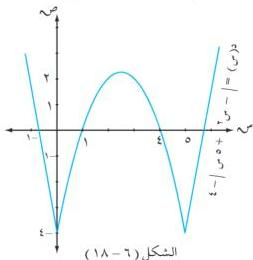

الوحدة السادسة

$$\text{قصوى } (\frac{9}{4}, \frac{5}{2}) \text{ ، النقطه } \frac{9}{4} = 4 - \frac{25}{2} + \frac{25}{2} = (\frac{5}{2})$$

$$\text{قصوى } (4 - 5) \text{ ، النقطه } 4 - 4 - 25 - 25 = (5)$$

$$\text{قصوى } (4 - 0) \text{ ، النقطه } 4 - 4 - 0 - 0 = (0)$$

$$\text{عندما } \text{ق(س)} > 0 \text{ ، فالدالة } \text{د تناقصية على الفترة } [0, \infty - \infty, 0] \cup [0, \infty - \infty]$$

$$\text{وعندما } \text{ق(س)} > 0 \text{ ، فالدالة } \text{د تزايدية في الفترة } [0, \infty - \infty, 0] \cup [0, \infty - \infty]$$

$$(4) \text{ وبوضع } \text{ق(س)} = 0 \text{ ، } \text{ق(س)} = 2 - \infty$$

∴ كل من ق(0) ، ق(5) غير موجودين ، فإن النقطتين (4 - 0) ، (4 - 0) نقطتا انعطاف.

$$(5) \text{ عند } \infty = 0 \Leftarrow \infty = 4 - \infty \text{ ، بيان الدالة يقطع } \infty \text{ في النقطه } (4 - 0)$$

$$\text{وعند } \infty = 0 \Leftarrow | - \infty + 5 \infty | = 4 - 0$$

$$\text{أما } - \infty + 5 \infty = 4 - 0 \Leftarrow \text{إما } \infty = 4 \text{ أو } \infty = 1$$

$$\text{أو } \infty + 5 \infty = 4 - 0 \Leftarrow \text{إما } \infty = \frac{\sqrt{4} + 5}{2} \text{ أو } \infty = \frac{\sqrt{4} - 5}{2}$$

$$\therefore \text{النقاط المساعدة هي : } (0, 4 - 0) \text{ ، } (0, 4 - 0) \text{ ، } (0, 1 - 0) \text{ ، } (\frac{\sqrt{4} + 5}{2}, 0) \text{ ، } (\frac{\sqrt{4} - 5}{2}, 0)$$

(6) نلخص ما سبق في الجدول التالي :

جدول (6 - 11)

|  س | ∞ + | 5 | 5 | 0 | ∞ -  |
| --- | --- | --- | --- | --- | --- |
|  ق(س) | + | - | 0 | + | -  |
|  ق(س) | ⊕ | ⊖ | ⊖ | ⊖ | ⊕  |
|  ق(س) | ∞ + | 4 - 1 | 4 | 4 - 1 | ∞ +  |

(7) نرسم بيان الدالة كما في الشكل (6 - 18).

# مثال (6 - 46)

$$\text{ادرس تغيرات الدالة } \text{ق(س)} = \frac{\infty + 3}{2 - 1} \text{ ، وارسم بيانها.}$$

الحل :

$$(1) \text{ م.ت = ح} / \{1\}$$

206

http://www.e-learning-moe.edu.ye/