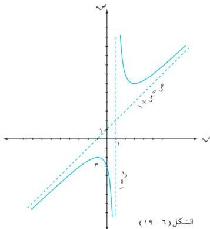

الوحدة السادسة

بوضع دَّ(س) = ٠ ⇐ دَّ(س) = ٨ ⇐ . . . لا يوجد نقاط انعطاف للدالة د .

٥) النقاط المساعدة :

عند س = ٠ ⇐ ص = ٣ + ٠ / (١ - ٠) = ٣ . . . المنحنى يقطع محور الصادات في النقطة (٠ - ٣)

وعند ص = ٠ ⇐ س² + ٣ = ٠ ، وحيث س² + ٣ < ٠

. . . المنحنى لا يقطع محور السينات .

٦) نلخص ما سبق في الجدول التالي :

جدول (٦ - ١٢)

|  س | ∞ + | ٣ | ١ | ١ - | ∞ -  |
| --- | --- | --- | --- | --- | --- |
|  دَّ(س) | + | ٠ | - | - | +  |
|  دَّ(س) |  | + |  | - |   |
|  د(س) | ∞ + | ٦ صغرى | ∞ + | ٢ - عظمى | ∞ -  |

٧) نرسم بيان الدالة كما في الشكل (٦ - ١٩) .

الشكل (٦ - ١٩)

٢٠٨

http://www.e-learning-moe.edu.ye/