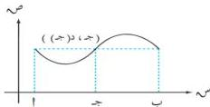

الوحدة السابعة

من هذه المتراجحة نستنتج أنه يوجد عدد ك حيث د(س₁) ≥ ك ≥ د(س₂)

يحقق د(س) و س = ك (ب - 1).

∴ د(س₁) ≥ د(س) ≥ د(س₂) ، د(س₁) ≥ ك ≥ د(س₂).

∴ يوجد على الأقل عدد ج [1، ب] بحيث د(ج) = ك

إذن د(س) و س = د(ج) (ب - 1) وهو المطلوب.

# التفسير الهندسي لمبرهنة القيمة المتوسطة :

إذا كانت الدالة د متصلة على [1، ب] ، ويقع بيانها فوق محور السينات كما في الشكل (٢ - ٧) ،

فإن : سط تكافئ مساحة المستطيل الذي بعده

(ب - 1) ، د(ج) حيث ج [1، ب] .

شكل (٢ - ٧)

# مثال (٧ - ١٣)

أوجد قيمة ج التي تحقق مبرهنة القيمة المتوسطة للتكامل إذا كانت :

د(س) = س ، س ≥ [ ٩ ، ٠ ]

# الحل :

د(س) و س = د(ج) (٩ - ٠)

د(س) و س = س ١/٢

د(س) و س = س ١/٢

د(س) و س = س ١/٢

∴ د(ج) = ٢

٢٢٨

http://www.e-learning-moe.edu.ye/