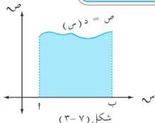
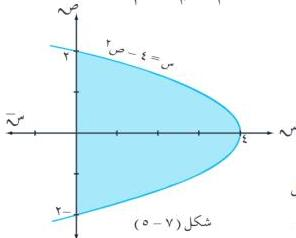

الوحدة السابعة

## تطبيقات التكامل

٦ - ٧

تأتي أهمية استخدام التكامل في تطبيقات كثيرة ، وفي هذا البند نتناول تطبيقين هندسيين للتكامل الأول يتعلق بحساب مساحة المناطق المستوية والآخر بحساب الحجم الدورانية .

## حساب مساحات المناطق المستوية

١ - ٦ - ٧

تعرفت فيما سبق أن مساحة المنطقة التي تقع تحت بيان دالة متصلة $x \in [1, 2, 3]$ ، وفوق محور السينات كما في الشكل (٧ - ٣) هي :

$$\text{سط } x = \frac{1}{2} \cdot x \text{ (س) و س} .$$

مثال (٧ - ٢٨)

احسب مساحة المنطقة المحصورة بين منحنى الدالة :  
ص = ٤ س - س² والمستقيمات س = ١ ،  
س = ٣ ، ص = ٠ .

### الحل :

لإيجاد نقاط تقاطع المنحنى مع محور السينات نضع ص = ٠  
$\leftarrow 4 \text{ س} - \text{س}^2 = 0 \leftarrow \text{س} (4 - \text{س}) = 0$   
$\leftarrow \text{س} = 0$ ، س = ٤ ، [٣، ١] [٤، ٠] .  
∴ فترة التكامل هي [٣، ١] ، ومن الشكل (٧ - ٤)

نجد أن : $\text{سط } \frac{3}{2} = \frac{1}{2} (4 \text{ س} - \text{س}^2) \text{ و س} = (2 \text{ س}^2 - \frac{3}{2}) \frac{3}{2} = \frac{22}{3}$ وحدة مربعة .

مثال (٧ - ٢٩)

احسب مساحة المنطقة المحددة بالقطع المكافئ :  
س = ٤ - ص² والمستقيم س = ٠ .

### الحل :

بوضع س = ٠ $\leftarrow$ ص = ٢ $\pm$

لاحظ المتغير ص من الدرجة الثانية وفترات التكامل على محور الصادات هي : [٢، ٠] ، [٠، ٢] .

٢٤٨

http://www.e-learning-moe.edu.ye/