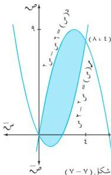

التكامل

ومن الشكل (٧ - ٥) نجد أن :

$$\text{سط}_2^2 = \text{سط}_2^2 (4 - \text{ص}^2) \text{ و ص}$$

$$\Leftarrow \text{سط}_2^2 = \text{سط}_2^2 (4 - \text{ص}^2) \text{ و ص} + \text{سط}_2^2 (4 - \text{ص}^2) \text{ و ص}$$

وحيث أن منحنى الدالة متماثل حول محور السينات

$$\therefore \text{سط}_2^2 = \text{سط}_2^2 (4 - \text{ص}^2) \text{ و ص} = 2 \times \frac{16}{3} = \frac{32}{3} \text{ وحدة مربعة .}$$

# **مثال (٧ - ٣٠)**

احسب المساحة المحددة بمنحنى الدالة : ص = لو س
والمستقيمات س = ٠ ، ص = ٠ ، ص = ٣ .

# **الحل :**

$$\text{ص} = \text{لو س} \Leftrightarrow \text{س} = \text{هـ ص} \text{ ،}$$

$$\therefore \text{سط}_1^2 = \text{سط}_1^2 \text{ س و ص} \text{ ، وحدود التكامل هي :}$$

$$1 = 0 \text{ ، ب} = 3 \text{ ، ومن الشكل (٧ - ٦) نجد أن :}$$

$$\text{سط}_1^3 = \text{سط}_1^3 \text{ هـ ص} \text{ و ص} = \text{هـ ص} \left| \begin{matrix} 3 \\ 1 \end{matrix} \right| = (\text{هـ} - 1) \text{ وحدة مربعة .}$$

# **مثال (٧ - ٣١)**

احسب المساحة المحصورة بين منحنى الدالتين : د(س) = ٦ س - س² ، م(س) = س² - س² .

# **الحل :**

لإيجاد نقاط تقاطع الدالتين نضع ٦ س - س² = س² - س²

$$\Leftarrow 2 \text{ س (س - ٤) = ٠}$$

$$\text{إما س} = 0 \text{ ، أو س} = 4$$

$$\therefore \text{حدود التكامل هي : ١ = ٠ ، ب} = 4 \text{ ،}$$

ومن الشكل (٧ - ٧) نجد أن :

$$\therefore \text{سط}_1^2 = \text{سط}_1^2 [\text{د(س) - م(س)}] \text{ و س}$$

$$\therefore \text{سط}_1^4 = \text{سط}_1^4 [(\text{س} - 2) - (\text{س} - 2) - (\text{س} - 2) - (\text{س} - 2) - (\text{س} - 2) - (\text{س} - 2) - (\text{س} - 2) - (\text{س} - 2) - (\text{س} - 2) - (\text{س} - 2) - (\text{س} - 2) - (\text{س} - 2) - (\text{س} - 2) - (\text{س} - 2)$$

$$= (4 \text{ س} - 2) - (3 \text{ س} - 2) \left| \begin{matrix} 3 \\ 1 \end{matrix} \right| = \frac{64}{3} \text{ وحدة مربعة .}$$

٢٤٩

http://www.e-learning-moe.edu.ye/