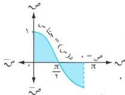

الوحدة السابعة

# **مثال (٧ - ٣٢)**

شكل (٧ - ٨)

أوجد المساحة المحصورة بين منحنى الدالة : د(س) = جتا س ،
ومحور السينات والمستقيمين س = ٠ ، س = π .

**الحل :** نوجد نقاط تقاطع المنحنى مع محور السينات بوضع ص = ٠

$$\Leftrightarrow \text{جتا س} = ٠ \Leftrightarrow \text{س} = \frac{\pi}{2} \Rightarrow [\pi, 0]$$

فترات التكامل هي : $[\pi, \frac{\pi}{2}, \frac{\pi}{2}, \pi]$ ،

ومن الشكل (٧ - ٨) نجد أن : $\text{سط} = \sqrt{\frac{\pi}{2}} [\text{جتا س} - 0] \text{ و س} + \sqrt{\frac{\pi}{2}} [\text{جتا س} - 0] \text{ و س} = \sqrt{\frac{\pi}{2}} \text{ جتا س} \text{ و س} - \sqrt{\frac{\pi}{2}} \text{ جتا س} \text{ و س} = \text{جتا س} \sqrt{\frac{\pi}{2}} - \text{جتا س} \sqrt{\frac{\pi}{2}} = 1 + 1 = 2$ وحدات مربعة.

**ملاحظة :** عندما يكون بيان الدالة أسفل محور السينات فإننا نغير إشارة الدالة عند إيجاد مساحة المنطقة المحصورة بين بيان الدالة ومحور السينات .

# **تمارين ومثال (٧ - ٦ - ١)**

[١] أوجد المساحة المحددة بالمنحنيات والمستقيمات التالية :

- أ) ص = لو س ، ص = هـ ، ص = ١ ، ص = ٣ .
- ب) ص = $\sqrt{1 + m}$ ، ص = ٠ ، ص = ٠ .
- ج) س = (ص - ١) ، ص = ٠ ، ص = ٢ .

[٢] احسب مساحة المنطقة المحصورة بمنحنى الدالة : ص = س² - س - ٦ ، والمستقيم ص = ٠ .

[٣] أوجد مساحة المنطقة المحددة بمنحنى القطع المكافئ : ص² = ٤ س والمستقيمات : س = ٤ ، س = ٩ .

[٤] احسب مساحة المنطقة بين القطع المكافئ : ص = ٤ - س² ومحور السينات .

[٥] بيّن أن مساحة المنطقة بين القطع المكافئ : ص² = س - ١ والمستقيم ص = س - ٣ تساوي $\frac{9}{2}$ وحدة مربعة .

[٦] أوجد المساحة المحصورة بين القطع الزائد : س ص = ب² والمستقيمات ص = ٠ ، س = ١ ، س = ١٢ .

[٧] احسب المساحة المحصورة بين منحني الدالتين : ص = $\frac{4}{2}$ ، ص = ٢ س والمستقيمين س = ١ ، س = ٢ .

[٨] احسب المساحة المحصورة بالمستقيم : ص + س = ١ والمحورين الإحداثيين .

[٩] أوجد مساحة المنطقة المحصورة بين المنحنى : ص = س² + ٢ س - ٨ والمستقيم : ص = ١٦ ، ومحور السينات السالب .

٢٥٠

http://www.e-learning-moe.edu.ye/