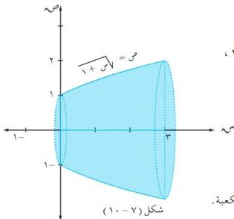
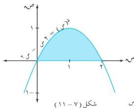

الوحدة السابعة

# **مثال (٧ - ٣٣)**

إذا كانت $x(m) = \sqrt{m + 1}$ ما حجم الجسم الناتج عن دوران المنطقة المحصورة بين منحنى الدالة $x$ والفترة $[0, 3]$ دورة كاملة حول محور السينات؟

# **الحل :**

∴ حدود التكامل هي: $t = 0$ ، $n = 3$ ، $x(m) = (m + 1)$ ،

ومن الشكل $(7 - 10)$ نجد أن :

$$\text{ح} = \pi \cdot (x(m))^2 \cdot m$$

$$\Leftarrow \text{ح} = \pi \cdot (m + 1) \cdot m$$

$$= \frac{\pi}{2} (m + 1)^2 \cdot \pi = \pi \cdot 15 \text{ وحدة مكعبة.}$$

# **مثال (٧ - ٣٤)**

ما حجم الجسم الناتج عن دوران المنطقة المحصورة بين منحنى الدالة $x(m) = 2m - m^2$ ومحور السينات، دورة كاملة حول محور السينات؟

# **الحل :**

لإيجاد نقاط تقاطع الدالة $x$ مع محور السينات نضع $2m - m^2 = 0$ $\Leftarrow m(2 - m) = 0$

$$\Leftarrow m = 0 \text{ أو } m = 2$$

∴ حدود التكامل هي: $t = 0$ ، $n = 2$

وبدوران المنطقة المحددة في الشكل $(7 - 11)$ حول

محور السينات دورة كاملة نجد أن :

$$\therefore \text{ح} = \pi \cdot (x(m))^2 \cdot m$$

$$\therefore \text{ح} = \pi \cdot (2m - m^2)^2 \cdot m$$

$$\Leftarrow \text{ح} = \pi \cdot (4m^2 + 3m^4 - 2m^4) \cdot m$$

$$\pi = [\frac{4}{3}m^3 - 4m^4 + \frac{5}{5}m^5] \cdot \pi \cdot 15 \text{ وحدة مكعبة.}$$

٢٥٢

http://www.e-learning-moe.edu.ye/