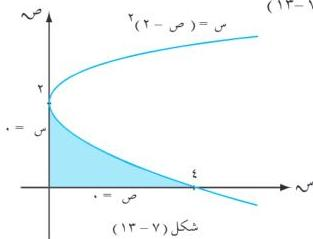
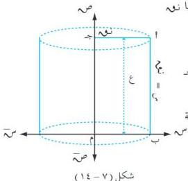

الوحدة السابعة

ثانياً : حجم الجسم الناتج عن دوران منطقة مستوية حول محور الصادات دورة كاملة :

إذا كانت المنطقة المستوية محصورة بين بيان الدالة $t$ والفترة $[t, n]$ من محور الصادات ، فإن الحجم الناتج من دوران هذه المنطقة دورة كاملة حول محور الصادات : $t = \pi$ (تا (ص) ٢) ، ص .

# **مثال (٧ - ٣٦)**

أوجد الحجم الدوراني للمنطقة المحددة بالقطع المكافئ (ص - ٢) $^2$ س ، والمحورين الإحداثيين دورة كاملة حول محور الصادات .

**الحل :** وبدوران المنطقة المحددة في الشكل (٧-١٣)

حول محور الصادات دورة كاملة نجد أن :

$t = \pi$ (تا (ص) ٢) ، ص

$= \pi$ (ص - ٢) ٤ ، ص

$= \frac{\pi (2 - \pi)}{5}$

$= \frac{\pi}{5} [ (32 - 0) ] = \pi$ وحدة مكعبة .

# **مثال (٧ - ٣٧)**

أوجد حجم الاسطوانة الدائرية القائمة التي نصف قطر قاعدتها $t$ وارتفاعها $t$ .

**الحل :**

نفرض المستطيل $t$ ب م ج إذا دار المستطيل $t$ ب م ج حول محور الصادات ، دورة كاملة

حيث م (٠ ، ٠) نقطة الأصل ، فإنه سيشكل اسطوانة دائرية قائمة نصف قطرها $t$ ج = نوه

وارتفاعها $t$ ب = ع ، كما في الشكل (٧-١٤) .

٢٥٤

http://www.e-learning-moe.edu.ye/