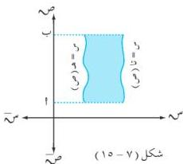

التكامل

وبما أن معادلة المستقيم $t$ هي : $m = \alpha$ ، والفترة $[0, \infty)$ من محور الصادات .

$$\therefore \alpha = \pi \quad \text{ف} \quad \text{ف} \quad \text{ف} \quad \text{ف} \quad \text{ف} \quad \text{ف} \quad \text{ف} \quad \text{ف} \quad \text{ف} \quad \text{ف} \quad \text{ف} \quad \text{ف} \quad \text{ف} \quad \text{ف} \quad \text{ف} \quad \text{ف} \quad \text{وحدة مكعبة} .$$

**ملاحظة :**

إذا كانت المنطقة المطلوب دورانها حول محور الصادات محصورة بين بيان منحني الدالتين تا ، هـ في الفترة $[t, \infty)$ من محور الصادات [ انظر الشكل (٧ - ١٥) ]؛ فإن حجم الجسم الناتج من الدوران دورة كاملة حول محور الصادات هو :

$$\alpha = \pi \quad \text{ف} \quad [\text{تا} (\text{ص}) - 2(\text{ص})] \quad \text{ف} \quad \text{ف} \quad \text{ف} \quad \text{ف} \quad \text{ف} \quad \text{ف} \quad \text{ف} \quad \text{ف} \quad \text{ف} \quad \text{ف} \quad \text{ف} \quad \text{ف} \quad \text{ف} \quad \text{ف} \quad \text{ف} \quad \text{ف} \quad \text{ف} \quad \text{ف} \quad \text{ف} \quad \text{ف} \quad \text{ف} \quad \text{ف} \quad \text{ف} \quad \text{ف} \quad \text{ف} \quad \text{ف} \quad \text{ف} \quad \text{ف} \quad \text{ف} \quad \text{ف} \quad \text{ف} \quad \text{ف} \quad \text{ف} \quad \text{ف} \quad \text{ف} \quad \text{ف} \quad \text{\text{ف}} \quad \text{\text{ف}} \quad \text{\text{ف}} \quad \text{\text{ف}} \quad \text{\text{ف}} \quad \text{\text{ف}} \quad \text{\text{ف}} \quad \text{\text{ف}} \quad \text{\text{ف}} \quad \text{\text{ف}} \quad \text{\text{ف}} \quad \text{\text{ف}} \quad \text{\text{ف}} \quad \text{\text{ف}} \quad \text{\text{ف}} \quad \text{\text{ف}} \quad \text{\text{ف}} \quad \text{\text{\text{ف}}},$$

**مثال (٧ - ٣٨)**

أوجد حجم الجسم الناتج عن دوران المنطقة المحصورة بين المنحنيين : ص = س ٢ ، ص = ٢ س حول محور الصادات دورة كاملة .

**الحل :**

بما أن الدوران حول محور الصادات نجد أن : $m = \pm \sqrt{2}$ ، $m = \frac{1}{2}$

$$\text{ولا إيجاد نقاط التقاطع نضع } \frac{1}{2} \text{ ص} = \pm \sqrt{2} \text{ ص} \quad \text{ص} \quad \frac{1}{4} \text{ ص} = \text{ص} \quad \text{ص} \quad \text{ص} \quad \text{ص} \quad \text{ص} \quad \text{ص} \quad \text{ص} \quad \text{ص} \quad \text{ص} \quad \text{ص} \quad \text{ص} \quad \text{ص} \quad \text{ص} \quad \text{ص} \quad \text{ص} \quad \text{ص} \quad \text{ص} \quad \text{ص} \quad \text{ص} \quad \text{ص} \quad \text{ص} \quad \text{ص} \quad \text{ص} \quad \text{ص} \quad \text{ص} \quad \text{ص} \quad \text{ص} \quad \text{ص} \quad \text{ص} \quad \text{ص} \quad \text{ص} \quad \text{ص} \quad \text{ص} \quad \text{ص} \quad \text{ص} \quad \text{ص} \quad \text{ص} \quad \text{ص} \quad \text{

∴ حدود التكامل هي : $t = 0$ ، $n = 4$ ،

وبدوران المنطقة المحددة في الشكل (٧ - ١٦)

دورة كاملة حول محور الصادات نجد أن :

$$\therefore \alpha = \pi \quad \text{ف} \quad [\text{تا} (\text{ص}) - 2(\text{ص})] \quad \text{ف} \quad \text{ف} \quad \text{ف} \quad \text{ف} \quad \text{ف} \quad \text{ف} \quad \text{ف} \quad \text{ف} \quad \text{ف} \quad \text{ف} \quad \text{ف} \quad \text{ف} \quad \text{ف} \quad \text{ف} \quad \text{ف} \quad \text{ف} \quad \text{ف} \quad \text{ف} \quad \text{ف} \quad \text{\text{ف}} \quad \text{\text{ف}} \quad \text{\text{ف}} \quad \text{\text{ف}} \quad \text{\text{ف}} \quad \text{\text{ف}} \quad \text{\text{ف}} \quad \text{\text{ف}} \quad \text{\text{ف}} \quad \text{\text{ف}} \quad \text{\text{ف}} \quad \text{\text{ف}} \quad \text{\text{ف}} \quad \text{\text{ف}} \quad \text{\text{ف}} \quad \text{\text{ف}} \quad \text{\text{ف}} \quad \text{\text{ف}} \quad \text{\text{ف}} \quad \text{\text{ف}} \quad \text{\text{ف}} \quad \text{\text{\text{ف}}},$$

$$\therefore \alpha = \pi \quad \text{ف} \quad [\text{تا} (\text{ص}) - 2(\text{ص})] \quad \text{ف} \quad \text{ف} \quad \text{ف} \quad \text{ف} \quad \text{ف} \quad \text{ف} \quad \text{ف} \quad \text{ف} \quad \text{ف} \quad \text{ف} \quad \text{ف} \quad \text{ف} \quad \text{ف} \quad \text{ف} \quad \text{\text{ف}} \quad \text{\text{ف}} \quad \text{\text{ف}} \quad \text{\text{ف}} \quad \text{\text{ف}} \quad \text{\text{ف}} \quad \text{\text{ف}} \quad \text{\text{ف}} \quad \text{\text{ف}} \quad \text{\text{ف}} \quad \text{\text{ف}} \quad \text{\text{ف}} \quad \text{\text{ف}} \quad \text{\text{ف}} \quad \text{\text{\text{ف}}},$$[{"box_2d": [548, 806, 813, 840], "label": "equation", "caption": "$$\\therefore \\alpha = \\pi \\quad \\text{ف} \\quad [\\text{ص} - \\frac{1}{4} \\text{ ص} - 2] \\text{ ص} \\quad \\text{ص} \\quad \\text{ص} \\quad \\text{ص} \\quad \\text{ص} \\quad \\text{ص} \\quad \\text{ص} \\quad \\text{ص} \\quad \\text{ص} \\quad \\text{ص} \\quad \\text{ص} \\quad \\text{ص} \\quad \\text{ص} \\quad \\text{ص} \\quad \\text{ص} \\quad \\text{ص} \\quad \\text{ص} \\quad \\text{\\text{ف}} \\quad \\text{\\text{ف}} \\quad \\text{\\text{ف}} \\quad \\text{\\text{ف}} \\quad \\text{\\text{ف}} \\quad \\text{\\text{ف}} \\quad \\text{\\text{ف}} \\quad \\text{\\text{ف}} \\quad \\text{\\text{ف}} \\quad \\text{\\text{ف}} \\quad \\text{\\text{ف}} \\quad \\text{\\text{ف}} \\quad \\text{\\text{ف}} \\quad \\text{\\text{ف}} \\quad \\text{\\text{ف}} \\quad \\text{\\text{ف}} \\quad \\text{\\text{ف}} \\quad \\text{\\text{ف}} \\quad \\text{\\text{ف}} \\quad \\text{\\text{ف}} \\quad \\text{\\text{ف}} \\quad \\text{\\text{ف}} \\quad \\text{\\text{ف}} \\quad \\text{\\text{ف}} \\quad \\text{\\text{ف}} \\quad \\text{\\text{ف}} \\quad \\text{\\text{ف}} \\quad \\text{\\text{ف}} \\quad \\text{\\text{ف}} \\quad \\text{\\text{ف}} \\quad \\text{\\text{ف}} \\quad \\text{\\text{ف}} \\quad \\text{\\text{ف}} \\quad \\text{\\text{ف}} \\quad \\text{\\text{ف}} \\quad \\text{\\text{ف}} \\quad \\text{\\text{ف}} \\quad \\text{\\text{ف}} \\\\ \\therefore \\alpha = \\pi \\quad \\text{ف} \\quad [\\text{تا} (\\text{ص}) - 2(\\text{ص})] \\text{ص} \\quad \\text{ص} \\quad \\text{ص} \\quad \\text{ص} \\quad \\text{ص} \\quad \\text{ص} \\quad \\text{ص} \\quad \\text{ص} \\quad \\text{ص} \\quad \\text{ص} \\quad \\text{ص} \\quad \\text{ص} \\quad \\text{ص} \\quad \\text{ص} \\quad \\text{ص} \\quad \\text{ص} \\quad \\text{ص} \\quad \\text{\\text{ف}} \\quad \\text{\\text{ف}} \\quad \\text{\\text{ف}} \\quad \\text{\\text{ف}} \\quad \\text{\\text{ف}} \\quad \\text{\\text{ف}} \\quad \\text{\\text{ف}} \\quad \\text{\\text{ف}} \\quad \\text{\\text{ف}} \\quad \\text{\\text{ف}} \\quad \\text{\\text{ف}} \\quad \\text{\\text{ف}} \\\\ \\therefore \\alpha = \\pi \\quad \\text{ف} \\quad [\\text{تا} (\\text{ص}) - 2(\\text{ص})] \\text{ص} \\quad \\text{ص} \\quad \\text{ص} \\quad \\text{ص} \\quad \\text{ص} \\quad \\text{ص} \\quad \\text{ص} \\quad \\text{ص} \\quad \\text{ص} \\quad \\text{ص} \\quad \\text{ص} \\quad \\text{ص} \\quad \\text{ص} \\quad \\text{ص} \\quad \\text{ص} \\quad \\text{ص} \\quad \\text{ص} \\quad \\text{\\text{ف}} \\quad \\text{\\text{ف}} \\quad \\text{\\text{ف}} \\quad \\text{\\text{ف}} \\quad \\text{\\text{ف}} \\quad \\text{\\text{ف}} \\quad \\text{\\text{ف}} \\quad \\text{\\text{ف}} \\quad \\text{\\text{ف}} \\quad \\text{\\text{ف}} \\quad \\text{\\text{ف}} \\\\ \\therefore \\alpha = \\pi \\quad \\text{ف} \\quad [\\text{تا} (\\text{ص}) - 2(\\text{ص})] \\text{ص} \\quad \\text{ص} \\quad \\text{ص} \\quad \\text{ص} \\quad \\text{ص} \\quad \\text{ص} \\quad \\text{ص} \\quad \\text{ص} \\quad \\text{ص} \\quad \\text{ص} \\quad \\text{ص} \\quad \\text{ص} \\quad \\text{ص} \\quad \\text{\\text{ف}} \\quad \\text{\\text{ف}} \\quad \\text{\\text{ف}} \\quad \\text{\\text{ف}} \\quad \\text{\\text{ف}} \\quad \\text{\\text{ف}} \\quad \\text{\\text{ف}} \\quad \\text{\\text{ف}} \\quad \\text{\\text{ف}} \\quad \\text{\\text{ف}} \\quad \\text{\\text{ف}} \\\\ \\therefore \\alpha = \\pi \\quad \\text{ف} \\quad [\\text{تا} (\\text{ص}) - 2(\\text{ص})] \\text{ص} \\quad \\text{ص} \\quad \\text{ص} \\quad \\text{ص} \\quad \\text{ص} \\quad \\text{ص} \\quad \\text{ص} \\quad \\text{ص} \\quad \\text{ص} \\quad \\text{ص} \\quad \\text{ص} \\quad \\text{ص} \\quad \\text{ص} \\quad \\text{ص} \\quad \\text{\\text{ف}} \\quad \\text{\\text{ف}} \\quad \\text{\\text{ف}} \\quad \\text{\\text{ف}} \\quad \\text{\\text{ف}} \\quad \\text{\\text{ف}} \\quad \\text{\\text{ف}} \\quad \\text{\\text{ف}} \\quad \\text{\\text{ف}} \\quad \\text{\\text{ف}} \\quad \\text{\\text{ف}} \\\\ \\therefore \\alpha = \\pi \\quad \\text{ف} \\quad [\\text{تا} (\\text{ص}) - 2(\\text{ص})] \\text{ص} \\quad \\text{ص} \\quad \\text{ص} \\quad \\text{ص} \\quad \\text{ص} \\quad \\text{ص} \\quad \\text{ص} \\quad \\text{ص} \\quad \\text{ص} \\quad \\text{ص} \\quad \\text{ص} \\quad \\text{ص} \\quad \\text{ص} \\quad \\text{ص} \\quad \\text{\\text{ف}} \\quad \\text{\\text{ف}} \\quad \\text{\\text{ف}} \\quad \\text{\\text{ف}} \\quad \\text{\\text{ف}} \\quad \\text{\\text{ف}} \\quad \\text{\\text{ف}} \\quad \\text{\\text{ف}} \\quad \\text{\\text{ف}} \\quad \\text{\\text{ف}} \\quad \\text{\\text{ف}} \\quad \\text{\\text{ف}} \\\\ \\therefore \\alpha = \\pi \\quad \\text{ف} \\quad [\\text{تا} (\\text{ص}) - 2(\\text{ص})] \\text{ص} \\quad \\text{ص} \\quad \\text{ص} \\quad \\text{ص} \\quad \\text{ص} \\quad \\text{ص} \\quad \\text{ص} \\quad \\text{ص} \\quad \\text{ص} \\quad \\text{ص} \\quad \\text{ص} \\quad \\text{ص} \\quad \\text{ص} \\quad \\text{ص} \\quad \\text{\\text{ف}} \\quad \\text{\\text{ف}} \\quad \\text{\\text{ف}} \\quad \\text{\\text{ف}} \\quad \\text{\\text{ف}} \\quad \\text{\\text{ف}} \\quad \\text{\\text{ف}} \\quad \\text{\\text{ف}} \\quad \\text{\\text{ف}} \\quad \\text{\\text{ف}} \\quad \\text{\\text{ف}} \\\\ \\therefore \\alpha = \\pi \\quad \\text{ف} \\quad [\\text{تا} (\\text{ص}) - 2(\\text{ص})] \\text{ص} \\quad \\text{ص} \\quad \\text{ص} \\quad \\text{ص} \\quad \\text{ص} \\quad \\text{ص} \\quad \\text{ص} \\quad \\text{ص} \\quad \\text{ص} \\quad \\text{ص} \\quad \\text{ص} \\quad \\text{ص} \\quad \\text{ص} \\quad \\text{ص} \\quad \\text{\\text{ف}} \\quad \\text{\\text{ف}} \\quad \\text{\\text{ف}} \\quad \\text{\\text{ف}} \\quad \\text{\\text{ف}} \\quad \\text{\\text{ف}} \\quad \\text{\\text{ف}} \\quad \\text{\\text{ف}} \\quad \\text{\\text{ف}} \\quad \\text{\\text{ف}} \\quad \\text{\\text{ف}} \\\\ \\therefore \\alpha = \\pi \\quad \\text{ف} \\quad [\\text{تا} (\\text{ص}) - 2(\\text{ص})] \\text{ص} \\quad \\text{ص} \\quad \\text{ص} \\quad \\text{ص} \\quad \\text{ص} \\quad \\text{ص} \\quad \\text{ص} \\quad \\text{ص} \\quad \\text{ص} \\quad \\text{ص} \\quad \\text{ص} \\quad \\text{ص} \\quad \\text{ص} \\quad \\text{\\text{ف}} \\quad \\text{\\text{ف}} \\quad \\text{\\text{ف}} \\quad \\text{\\text{ف}} \\quad \\text{\\text{ف}} \\quad \\text{\\text{ف}} \\quad \\text{\\text{ف}} \\quad \\text{\\text{ف}} \\quad \\text{\\text{ف}} \\quad \\text{\\text{ف}} \\quad \\text{\\text{ف}} \\\\ \\therefore \\alpha = \\pi \\quad \\text{ف} \\quad [\\text{تا} (\\text{ص}) - 2(\\text{ص})] \\text{ص} \\quad \\text{ص} \\quad \\text{ص} \\quad \\text{ص} \\quad \\text{ص} \\quad \\text{ص} \\quad \\text{ص} \\quad \\text{ص} \\quad \\text{ص} \\quad \\text{ص} \\quad \\text{ص} \\quad \\text{ص} \\quad \\text{ص} \\quad \\text{\\text{ف}} \\quad \\text{\\text{ف}} \\quad \\text{\\text{ف}} \\quad \\text{\\text{ف}} \\quad \\text{\\text{ف}} \\quad \\text{\\text{ف}} \\quad \\text{\\text{ف}} \\quad \\text{\\text{ف}} \\quad \\text{\\text{ف}} \\quad \\text{\\text{ف}} \\quad \\text{\\text{ف}} \\\\ \\therefore \\alpha = \\pi \\quad \\text{ف} \\quad [\\text{تا} (\\text{ص}) - 2(\\text{ص})] \\text{ص} \\quad \\text{ص} \\quad \\text{ص} \\quad \\text{ص} \\quad \\text{ص} \\quad \\text{ص} \\quad \\text{ص} \\quad \\text{ص} \\quad \\text{ص} \\quad \\text{ص} \\quad \\text{ص} \\quad \\text{ص} \\quad \\text{ص} \\quad \\text{\\text{ف}} \\quad \\text{\\text{ف}} \\quad \\text{\\text{ف}} \\quad \\text{\\text{ف}} \\quad \\text{\\text{ف}} \\quad \\text{\\text{ف}} \\quad \\text{\\text{ف}} \\quad \\text{\\text{ف}} \\quad \\text{\\text{ف}} \\quad \\text{\\text{ف}} \\quad \\text{\\text{ف}} \\\\ \\therefore \\alpha = \\pi \\quad \\text{ف} \\quad [\\text{تا} (\\text{ص}) - 2(\\text{ص})] \\text{ص} \\quad \\text{ص} \\quad \\text{ص} \\quad \\text{ص} \\quad \\text{ص} \\quad \\text{ص} \\quad \\text{ص} \\quad \\text{ص} \\quad \\text{ص} \\quad \\text{ص} \\quad \\text{ص} \\quad \\text{ص} \\quad \\text{ص} \\quad \\text{\\text{ف}} \\quad \\text{\\text{ف}} \\quad \\text{\\text{ف}} \\quad \\text{\\text{ف}} \\quad \\text{\\text{ف}} \\quad \\text{\\text{ف}} \\quad \\text{\\text{ف}} \\quad \\text{\\text{ف}} \\quad \\text{\\text{ف}} \\quad \\text{\\text{ف}} \\quad \\text{\\text{ف}} \\\\ \\therefore \\alpha = \\pi \\quad \\text{ف} \\quad [\\text{تا} (\\text{ص}) - 2(\\text{ص})] \\text{ص} \\quad \\text{ص} \\quad \\text{ص} \\quad \\text{ص} \\quad \\text{ص} \\quad \\text{ص} \\quad \\text{ص} \\quad \\text{ص} \\quad \\text{ص} \\quad \\text{ص} \\quad \\text{ص} \\quad \\text{ص} \\quad \\text{ص} \\quad \\text{\\text{ف}} \\quad \\text{\\text{ف}} \\quad \\text{\\text{ف}} \\quad \\text{\\text{ف}} \\quad \\text{\\text{ف}} \\quad \\text{\\text{ف}} \\quad \\text{\\text{ف}} \\quad \\text{\\text{ف}} \\quad \\text{\\text{ف}} \\\\ \\therefore \\alpha = \\pi \\quad \\text{ف} \\quad [\\text{تا} (\\text{ص}) - 2(\\text{ص})] \\text{ص} \\quad \\text{ص} \\quad \\text{ص} \\quad \\text{ص} \\quad \\text{ص} \\quad \\text{ص} \\quad \\text{ص} \\quad \\text{ص} \\quad \\text{ص} \\quad \\text{ص} \\quad \\text{ص} \\quad \\text{ص} \\quad \\text{ص} \\quad \\text{\\text{ف}} \\quad \\text{\\text{ف}} \\quad \\text{\\text{ف}} \\quad \\text{\\text{ف}} \\quad \\text{\\text{ف}} \\quad \\text{\\text{ف}} \\quad \\text{\\text{ف}} \\quad \\text{\\text{ف}} \\quad \\text{\\text{ف}} \\\\ \\therefore \\alpha = \\pi \\quad \\text{ف} \\quad [\\text{تا} (\\text{ص}) - 2(\\text{ص})] \\text{ص} \\quad \\text{ص} \\quad \\text{ص} \\quad \\text{ص} \\quad \\text{ص} \\quad \\text{ص} \\quad \\text{ص} \\quad \\text{ص} \\quad \\text{ص} \\quad \\text{ص} \\quad \\text{ص} \\quad \\text{ص} \\quad \\text{ص} \\quad \\text{\\text{ف}} \\quad \\text{\\text{ف}} \\quad \\text{\\text{ف}} \\quad \\text{\\text{ف}} \\quad \\text{\\text{ف}} \\quad \\text{\\text{ف}} \\quad \\text{\\text{ف}} \\quad \\text{\\text{ف}} \\\\ \\therefore \\alpha = \\pi \\quad \\text{ف} \\quad [\\text{تا} (\\text{ص}) - 2(\\text{ص})] \\text{ص} \\quad \\text{ص} \\quad \\text{ص} \\quad \\text{ص} \\quad \\text{ص} \\quad \\text{ص} \\quad \\text{ص} \\quad \\text{ص} \\quad \\text{ص} \\quad \\text{ص} \\quad \\text{ص} \\quad \\text{ص} \\quad \\text{ص} \\quad \\text{\\text{ف}} \\quad \\text{\\text{ف}} \\quad \\text{\\text{ف}} \\quad \\text{\\text{ف}} \\quad \\text{\\text{ف}} \\quad \\text{\\text{ف}} \\quad \\text{\\text{ف}} \\quad \\text{\\text{ف}} \\quad \\text{\\text{ف}} \\\\ \\therefore \\alpha = \\pi \\quad \\text{ف} \\quad [\\text{تا} (\\text{ص}) - 2(\\text{ص})] \\text{ص} \\quad \\text{ص} \\quad \\text{ص} \\quad \\text{ص} \\quad \\text{ص} \\quad \\text{ص} \\quad \\text{ص} \\quad \\text{ص} \\quad \\text{ص} \\quad \\text{ص} \\quad \\text{ص} \\quad \\text{\\text{ف}} \\quad \\text{\\text{ف}} \\quad \\text{\\text{ف}} \\quad \\text{\\text{ف}} \\quad \\text{\\text{ف}} \\quad \\text{\\text{ف}} \\quad \\text{\\text{ف}} \\quad \\text{\\text{ف}} \\quad \\text{\\text{ف}} \\\\ \\therefore \\alpha = \\pi \\quad \\text{ف} \\quad [\\text{تا} (\\text{ص}) - 2(\\text{ص})] \\text{ص} \\quad \\text{ص} \\quad \\text{ص} \\quad \\text{ص} \\quad \\text{ص} \\quad \\text{ص} \\quad \\text{ص} \\quad \\text{ص} \\quad \\text{ص} \\quad \\text{ص} \\quad \\text{ص} \\quad \\text{ص} \\quad \\text{ص} \\quad \\text{\\text{ف}} \\quad \\text{\\text{ف}} \\quad \\text{\\text{ف}} \\quad \\text{\\text{ف}} \\quad \\text{\\text{ف}} \\quad \\text{\\text{ف}} \\quad \\text{\\text{ف}} \\quad \\text{\\text{ف}} \\quad \\text{\\text{ف}} \\quad \\text{\\text{ف}} \\\\ \\therefore \\alpha = \\pi \\quad \\text{ف} \\quad [\\text{تا} (\\text{ص}) - 2(\\text{ص})] \\text{ص} \\quad \\text{ص} \\quad \\text{ص} \\quad \\text{ص} \\quad \\text{ص} \\quad \\text{ص} \\quad \\text{ص} \\quad \\text{ص} \\quad \\text{ص} \\quad \\text{ص} \\quad \\text{ص} \\quad \\text{ص} \\quad \\text{\\text{ف}} \\quad \\text{\\text{ف}} \\quad \\text{\\text{ف}} \\quad \\text{\\text{ف}} \\quad \\text{\\text{ف}} \\quad \\text{\\text{ف}} \\quad \\text{\\text{ف}} \\quad \\text{\\text{ف}} \\quad \\text{\\text{ف}} \\\\ \\therefore \\alpha = \\pi \\quad \\text{ف} \\quad [\\text{تا} (\\text{ص}) - 2(\\text{ص})] \\text{ص} \\quad \\text{ص} \\quad \\text{ص} \\quad \\text{ص} \\quad \\text{ص} \\quad \\text{ص} \\quad \\text{ص} \\quad \\text{ص} \\quad \\text{ص} \\quad \\text{ص} \\quad \\text{ص} \\quad \\text{ص} \\quad \\text{\\text{ف}} \\quad \\text{\\text{ف}} \\quad \\text{\\text{ف}} \\quad \\text{\\text{ف}} \\quad \\text{\\text{ف}} \\quad \\text{\\text{ف}} \\quad \\text{\\text{ف}} \\\\ \\therefore \\alpha = \\pi \\quad \\text{ف} \\quad [\\text{تا} (\\text{ص}) - 2(\\text{ص})] \\text{ص} \\quad \\text{ص} \\quad \\text{ص} \\quad \\text{ص} \\quad \\text{ص} \\quad \\text{ص} \\quad \\text{ص} \\quad \\text{ص} \\quad \\text{ص} \\quad \\text{ص} \\quad \\text{ص} \\quad \\text{\\text{ف}} \\quad \\text{\\text{ف}} \\quad \\text{\\text{ف}} \\quad \\text{\\text{ف}} \\quad \\text{\\text{ف}} \\quad \\text{\\text{ف}} \\quad \\text{\\text{ف}} \\quad \\text{\\text{ف}} \\\\ \\therefore \\alpha = \\pi \\quad \\text{ف} \\quad [\\text{تا} (\\text{ص}) - 2(\\text{ص})] \\text{ص} \\quad \\text{ص} \\quad \\text{ص} \\quad \\text{ص} \\quad \\text{ص} \\quad \\text{ص} \\quad \\text{ص} \\quad \\text{ص} \\quad \\text{ص} \\quad \\text{ص} \\quad \\text{ص} \\quad \\text{ص} \\quad \\text{\\text{ف}} \\quad \\text{\\text{ف}} \\quad \\text{\\text{ف}} \\quad \\text{\\text{ف}} \\quad \\text{\\text{ف}} \\quad \\text{\\text{ف}} \\quad \\text{\\text{ف}} \\quad \\text{\\text{ف}} \\quad \\text{\\text{ف}} \\quad \\text{\\text{ف}} \\\\ \\therefore \\alpha = \\pi \\quad \\text{ف} \\quad [\\text{تا} (\\text{ص}) - 2(\\text{ص})] \\text{ص} \\quad \\text{ص} \\quad \\text{ص} \\quad \\text{ص} \\quad \\text{ص} \\quad \\text{ص} \\quad \\text{ص} \\quad \\text{ص} \\quad \\text{ص} \\quad \\text{ص} \\quad \\text{ص} \\quad \\text{ص} \\quad \\text{\\text{ف}} \\quad \\text{\\text{ف}} \\quad \\text{\\text{ف}} \\quad \\text{\\text{ف}} \\quad \\text{\\text{ف}} \\quad \\text{\\text{ف}} \\quad \\text{\\text{ف}} \\quad \\text{\\text{ف}} \\quad \\text{\\text{ف}} \\quad \\text{\\text{ف}} \\\\ \\therefore \\alpha = \\pi \\quad \\text{ف} \\quad [\\text{تا} (\\text{ص}) - 2(\\text{ص})] \\text{ص} \\quad \\text{ص} \\quad \\text{ص} \\quad \\text{ص} \\quad \\text{ص} \\quad \\text{ص} \\quad \\text{ص} \\quad \\text{ص} \\quad \\text{ص} \\quad \\text{ص} \\quad \\text{ص} \\quad \\text{\\text{ف}} \\quad \\text{\\text{ف}} \\quad \\text{\\text{ف}} \\quad \\text{\\text{ف}} \\quad \\text{\\text{ف}} \\quad \\text{\\text{ف}} \\quad \\text{\\text{ف}} \\quad \\text{\\text{ف}} \\quad \\text{\\text{ف}} \\quad \\text{\\text{ف}} \\\\ \\therefore \\alpha = \\pi \\quad \\text{ف} \\quad [\\text{تا} (\\text{ص}) - 2(\\text{ص})] \\text{ص} \\quad \\text{ص} \\quad \\text{ص} \\quad \\text{ص} \\quad \\text{ص} \\quad \\text{ص} \\quad \\text{ص} \\quad \\text{ص} \\quad \\text{ص} \\quad \\text{ص} \\quad \\text{ص} \\quad \\text{\\text{ف}} \\quad \\text{\\text{ف}} \\quad \\text{\\text{ف}} \\quad \\text{\\text{ف}} \\quad \\text{\\text{ف}} \\quad \\text{\\text{ف}} \\quad \\text{\\text{ف}} \\quad \\text{\\text{ف}} \\quad \\text{\\text{ف}} \\quad \\text{\\text{ف}} \\quad \\text{\\text{ف}} \\\\ \\therefore \\alpha = \\pi \\quad \\text{ف} \\quad [\\text{تا} (\\text{ص}) - 2(\\text{ص})] \\text{ص} \\quad \\text{ص} \\quad \\text{ص} \\quad \\text{ص} \\quad \\text{ص} \\quad \\text{ص} \\quad \\text{ص} \\quad \\text{ص} \\quad \\text{ص} \\quad \\text{ص} \\quad \\text{ص} \\quad \\text{\\text{ف}} \\quad \\text{\\text{ف}} \\quad \\text{\\text{ف}} \\quad \\text{\\text{ف}} \\quad \\text{\\text{ف}} \\quad \\text{\\text{ف}} \\quad \\text{\\text{ف}} \\quad \\text{\\text{ف}} \\quad \\text{\\text{ف}} \\quad \\text{\\text{ف}} \\\\ \\therefore \\alpha = \\pi \\quad \\text{ف} \\quad [\\text{تا} (\\text{ص}) - 2(\\text{ص})] \\text{ص} \\quad \\text{ص} \\quad \\text{ص} \\quad \\text{ص} \\quad \\text{ص} \\quad \\text{ص} \\quad \\text{ص} \\quad \\text{ص} \\quad \\text{ص} \\quad \\text{ص} \\quad \\text{ص} \\quad \\text{\\text{ف}} \\quad \\text{\\text{ف}} \\quad \\text{\\text{ف}} \\quad \\text{\\text{ف}} \\quad \\text{\\text{ف}} \\quad \\text{\\text{ف}} \\quad \\text{\\text{ف}} \\quad \\text{\\text{ف}} \\quad \\text{\\text{ف}} \\quad \\text{\\text{ف}} \\\\ \\therefore \\alpha = \\pi \\quad \\text{ف} \\quad [\\text{تا} (\\text{ص}) - 2(\\text{ص})] \\text{ص} \\quad \\text{ص} \\quad \\text{ص} \\quad \\text{ص} \\quad \\text{ص} \\quad \\text{ص} \\quad \\text{ص} \\quad \\text{ص} \\quad \\text{ص} \\quad \\text{ص} \\quad \\text{ص} \\quad \\text{\\text{ف}} \\quad \\text{\\text{ف}} \\quad \\text{\\text{ف}} \\quad \\text{\\text{ف}} \\quad \\text{\\text{ف}} \\quad \\text{\\text{ف}} \\quad \\text{\\text{ف}} \\quad \\text{\\text{ف}} \\quad \\text{\\text{ف}} \\quad \\text{\\text{ف}} \\quad \\text{\\text{ف}} \\\\ \\therefore \\alpha = \\pi \\quad \\text{ف} \\quad [\\text{تا} (\\text{ص}) - 2(\\text{ص})] \\text{ص} \\quad \\text{ص} \\quad \\text{ص} \\quad \\text{ص} \\quad \\text{ص} \\quad \\text{ص} \\quad \\text{ص} \\quad \\text{ص} \\quad \\text{ص} \\quad \\text{ص} \\quad \\text{\\text{ف}} \\quad \\text{\\text{ف}} \\quad \\text{\\text{ف}} \\quad \\text{\\text{ف}} \\quad \\text{\\text{ف}} \\quad \\text{\\text{ف}} \\quad \\text{\\text{ف}} \\quad \\text{\\text{ف}} \\quad \\text{\\text{ف}} \\\\ \\therefore \\alpha = \\pi \\quad \\text{ف} \\quad [\\text{تا} (\\text{ص}) - 2(\\text{ص})] \\text{ص} \\quad \\text{ص} \\quad \\text{ص} \\quad \\text{ص} \\quad \\text{ص} \\quad \\text{ص} \\quad \\text{ص} \\quad \\text{ص} \\quad \\text{ص} \\quad \\text{ص} \\quad \\text{\\text{ف}} \\quad \\text{\\text{ف}} \\quad \\text{\\text{ف}} \\quad \\text{\\text{ف}} \\quad \\text{\\text{ف}} \\quad \\text{\\text{ف}} \\quad \\text{\\text{ف}} \\quad \\text{\\text{ف}} \\quad \\text{\\text{ف}} \\quad \\text{\\text{ف}} \\quad \\text{\\text{ف}} \\\\ \\therefore \\alpha = \\pi \\quad \\text{ف} \\quad [\\text{تا} (\\text{ص}) - 2(\\text{ص})] \\text{ص} \\quad \\text{ص} \\quad \\text{ص} \\quad \\text{ص} \\quad \\text{ص} \\quad \\text{ص} \\quad \\text{ص} \\quad \\text{ص} \\quad \\text{ص} \\quad \\text{ص} \\quad \\text{\\text{ف}} \\quad \\text{\\text{ف}} \\quad \\text{\\text{ف}} \\quad \\text{\\text{ف}} \\quad \\text{\\text{ف}} \\quad \\text{\\text{ف}} \\quad \\text{\\text{ف}} \\quad \\text{\\text{ف}} \\quad \\text{\\text{ف}} \\quad \\text{\\text{ف}} \\quad \\text{\\text{ف}} \\\\ \\therefore \\alpha = \\pi \\quad \\text{ف} \\quad [\\text{تا} (\\text{ص}) - 2(\\text{ص})] \\text{ص} \\quad \\text{ص} \\quad \\text{ص} \\quad \\text{ص} \\quad \\text{ص} \\quad \\text{ص} \\quad \\text{ص} \\quad \\text{ص} \\quad \\text{ص} \\quad \\text{ص} \\quad \\text{\\text{ف}} \\quad \\text{\\text{ف}} \\quad \\text{\\text{ف}} \\quad \\text{\\text{ف}} \\quad \\text{\\text{ف}} \\quad \\text{\\text{ف}} \\quad \\text{\\text{ف}} \\quad \\text{\\text{ف}} \\quad \\text{\\text{ف}} \\quad \\text{\\text{ف}} \\quad \\text{\\text{ف}} \\\\ \\therefore \\alpha = \\pi \\quad \\text{ف} \\quad [\\text{تا} (\\text{ص}) - 2(\\text{ص})] \\text{ص} \\quad \\text{ص} \\quad \\text{ص} \\quad \\text{ص} \\quad \\text{ص} \\quad \\text{ص} \\quad \\text{ص} \\quad \\text{ص} \\quad \\text{ص} \\quad \\text{ص} \\quad \\text{\\text{ف}} \\quad \\text{\\text{ف}} \\quad \\text{\\text{ف}} \\quad \\text{\\text{ف}} \\quad \\text{\\text{ف}} \\quad \\text{\\text{ف}} \\quad \\text{\\text{ف}} \\quad \\text{\\text{ف}} \\quad \\text{\\text{ف}} \\quad \\text{\\text{ف}} \\quad \\text{\\text{ف}} \\quad \\text{\\text{ف}} \\quad \\text{\\text{ف}} \\quad \\text{\\text{ف}} \\quad \\text{\\text{ف}} \\quad \\text{\\text{ف}} \\quad \\text{\\text{ف}} \\quad \\text{\\text{ف}} \\quad \\text{\\text{ف}} \\quad \\text{\\text{ف}} \\quad \\text{\\text{ف}} \\quad \\text{\\text{ف}} \\quad \\text{\\text{ف}} \\quad \\text{\\text{ف}} \\quad \\text{\\text{ف}} \\quad \\text{\\text{ف}} \\quad \\text{\\text{ف}} \\quad \\text{\\text{ف}} \\quad \\text{\\text{ف}} \\quad \\text{\\text{ف}} \\quad \\text{\\text{ف}} \\quad \\text{\\text{ف}} \\quad \\text{\\text{ف}} \\quad \\text{\\text{ف}} \\quad \\text{\\text{ف}} \\quad \\text{\\text{ف}} \\quad \\text{\\text{ف}} \\quad \\text{\\text{ف}} \\quad \\text{\\text{ف}} \\quad \\text{\\text{ف}} \\quad \\text{\\text{ف}} \\quad \\text{\\text{ف}} \\quad \\text{\\text{ف}} \\quad \\text{\\text{ف}} \\quad \\text{\\text{ف}} \\quad \\text{\\text{ف}} \\quad \\text{\\text{ف}} \\quad \\text{\\text{ف}} \\quad \\text{\\text{ف}} \\quad \\text{\\text{ف}} \\quad \\text{\\text{ف}} \\quad \\text{\\text{ف}} \\quad \\text{\\text{ف}} \\quad \\text{\\text{ف}} \\quad \\text{\\text{ف}} \\quad \\text{\\text{ف}} \\quad \\text{\\text{ف}} \\quad \\text{\\text{ف}} \\quad \\text{\\text{ف}} \\quad \\text{\\text{ف}} \\quad \\text{\\text{ف}} \\quad \\text{\\text{ف}} \\quad \\text{\\text{ف}} \\quad \\text{\\text{ف}} \\quad \\text{\\text{ف}} \\quad \\text{\\text{ف}} \\quad \\text{\\text{ف}} \\quad \\text{\\text{ف}} \\quad \\text{\\text{ف}} \\quad \\text{\\text{ف}} \\quad \\text{\\text{ف}} \\quad \\text{\\text{ف}} \\quad \\text{\\text{ف}} \\quad \\text{\\text{ف}} \\quad \\text{\\text{ف}} \\quad \\text{\\text{ف}} \\quad \\text{\\text{ف}} \\quad \\text{\\text{ف}} \\quad \\text{\\text{ف}} \\quad \\text{\\text{ف}} \\quad \\text{\\text{ف}} \\quad \\text{\\text{ف}} \\quad \\text{\\text{ف}} \\quad \\text{\\text{ف}} \\quad \\text{\\text{ف}} \\quad \\text{\\text{ف}} \\quad \\text{\\text{ف}} \\quad \\text{\\text{ف}} \\quad \\text{\\text{ف}} \\quad \\text{\\text{ف}} \\quad \\text{\\text{ف}} \\quad \\text{\\text{ف}} \\quad \\text{\\text{ف}} \\quad \\text{\\text{ف}} \\quad \\text{\\text{ف}} \\quad \\text{\\text{ف}} \\quad \\text{\\text{ف}} \\quad \\text{\\text{ف}} \\quad \\text{\\text{ف}} \\quad \\text{\\text{ف}} \\quad \\text{\\text{ف}} \\quad \\text{\\text{ف}} \\quad \\text{\\text{ف}} \\quad \\text{\\text{ف}} \\quad \\text{\\text{ف}} \\quad \\text{\\text{ف}} \\quad \\text{\\text{ف}} \\quad \\text{\\text{ف}} \\quad \\text{\\text{ف}} \\quad \\text{\\text{ف}} \\quad \\text{\\text{ف}} \\quad \\text{\\text{ف}} \\quad \\text{\\text{ف}} \\quad \\text{\\text{ف}} \\quad \\text{\\text{ف}} \\quad \\text{\\text{ف}} \\quad \\text{\\text{ف}} \\quad \\text{\\text{ف}} \\quad \\text{\\text{ف}} \\quad \\text{\\text{ف}} \\quad \\text{\\text{ف}} \\quad \\text{\\text{ف}} \\quad \\text{\\text{ف}} \\quad \\text{\\text{ف}} \\quad \\text{\\text{ف}} \\quad \\text{\\text{ف}} \\quad \\text{\\text{ف}} \\quad \\text{\\text{ف}} \\quad \\text{\\text{ف}} \\quad \\text{\\text{ف}} \\quad \\text{\\text{ف}} \\quad \\text{\\text{ف}} \\quad \\text{\\text{ف}} \\quad \\text{\\text{ف}} \\quad \\text{\\text{ف}} \\quad \\text{\\text{ف}} \\quad \\text{\\text{ف}} \\quad \\text{\\text{ف}} \\quad \\text{\\text{ف}} \\quad \\text{\\text{ف}} \\quad \\text{\\text{ف}} \\quad \\text{\\text{ف}} \\quad \\text{\\text{ف}} \\quad \\text{\\text{ف}} \\quad \\text{\\text{ف}} \\quad \\text{\\text{ف}} \\quad \\text{\\text{ف}} \\quad \\text{\\text{ف}} \\quad \\text{\\text{ف}} \\quad \\text{\\text{ف}} \\quad \\text{\\text{ف}} \\quad \\text{\\text{ف}} \\quad \\text{\\text{ف}} \\quad \\text{\\text{ف}} \\quad \\text{\\text{ف}} \\quad \\text{\\text{ف}} \\quad \\text{\\text{ف}} \\quad \\text{\\text{ف}} \\quad \\text{\\text{ف}} \\quad \\text{\\text{ف}} \\quad \\text{\\text{ف}} \\quad \\text{\\text{ف}} \\quad \\text{\\text{ف}} \\quad \\text{\\text{ف}} \\quad \\text{\\text{ف}} \\quad \\text{\\text{ف}} \\quad \\text{\\text{ف}} \\quad \\text{\\text{ف}} \\quad \\text{\\text{ف}} \\quad \\text{\\text{ف}} \\quad \\text{\\text{ف}} \\quad \\text{\\text{ف}} \\quad \\text{\\text{ف}} \\quad \\text{\\text{ف}} \\quad \\text{\\text{ف}} \\quad \\text{\\text{ف}} \\quad \\text{\\text{ف}} \\quad \\text{\\text{ف}} \\quad \\text{\\text{ف}} \\quad \\text{\\text{ف}} \\quad \\text{\\text{ف}} \\quad \\text{\\text{ف}} \\quad \\text{\\text{ف}} \\quad \\text{\\text{ف}} \\quad \\text{\\text{ف}} \\quad \\text{\\text{ف}} \\quad \\text{\\text{ف}} \\quad \\text{\\text{ف}} \\quad \\text{\\text{ف}} \\quad \\text{\\text{ف}} \\quad \\text{\\text{ف}} \\quad \\text{\\text{ف}} \\quad \\text{\\text{ف}} \\quad \\text{\\text{ف}} \\quad \\text{\\text{ف}} \\quad \\text{\\text{ف}} \\quad \\text{\\text{ف}} \\quad \\text{\\text{ف}} \\quad \\text{\\text{ف}} \\quad \\text{\\text{ف}} \\quad \\text{\\text{ف}} \\quad \\text{\\text{ف}} \\quad \\text{\\text{ف}} \\quad \\text{\\text{ف}} \\quad \\text{\\text{ف}} \\quad \\text{\\text{ف}} \\quad \\text{\\text{ف}} \\quad \\text{\\text{ف}} \\quad \\text{\\text{ف}} \\quad \\text{\\text{ف}} \\quad \\text{\\text{ف}} \\quad \\text{\\text{ف}} \\quad \\text{\\text{ف}} \\quad \\text{\\text{ف}} \\quad \\text{\\text{ف}} \\quad \\text{\\text{ف}} \\quad \\text{\\text{ف}} \\quad \\text{\\text{ف}} \\quad \\text{\\text{ف}} \\quad \\text{\\text{ف}} \\quad \\text{\\text{ف}} \\quad \\text{\\text{ف}} \\quad \\text{\\text{ف}} \\quad \\text{\\text{ف}} \\quad \\text{\\text{ف}} \\quad \\text{\\text{ف}} \\quad \\text{\\text{ف}} \\quad \\text{\\text{ف}} \\quad \\text{\\text{ف}} \\quad \\text{\\text{ف}} \\quad \\text{\\text{ف}} \\quad \\text{\\text{ف}} \\quad \\text{\\text{ف}} \\quad \\text{\\text{ف}} \\quad \\text{\\text{ف}} \\quad \\text{\\text{ف}} \\quad \\text{\\text{ف}} \\quad \\text{\\text{ف}} \\quad \\text{\\text{ف}} \\quad \\text{\\text{ف}} \\quad \\text{\\text{ف}} \\quad \\text{\\text{ف}} \\quad \\text{\\text{ف}} \\quad \\text{\\text{ف}} \\quad \\text{\\text{ف}} \\quad \\text{\\text{ف}} \\quad \\text{\\text{ف}} \\quad \\text{\\text{ف}} \\quad \\text{\\text{ف}} \\quad \\text{\\text{ف}} \\quad \\text{\\text{ف}} \\quad \\text{\\text{ف}} \\quad \\text{\\text{ف}} \\quad \\text{\\text{ف}} \\quad \\text{\\text{ف}} \\quad \\text{\\text{ف}} \\quad \\text{\\text{ف}} \\quad \\text{\\text{ف}} \\quad \\text{\\text{ف}} \\quad \\text{\\text{ف}} \\quad \\text{\\text{ف}} \\quad \\text{\\text{ف}} \\quad \\text{\\text{ف}} \\quad \\text{\\text{ف}} \\quad \\text{\\text{ف}} \\quad \\text{\\text{ف}} \\quad \\text{\\text{ف}} \\quad \\text{\\text{ف}} \\quad \\text{\\text{ف}} \\quad \\text{\\text{ف}} \\quad \\text{\\text{ف}} \\quad \\text{\\text{ف}} \\quad \\text{\\text{ف}} \\quad \\text{\\text{ف}} \\quad \\text{\\text{ف}} \\quad \\text{\\text{ف}} \\quad \\text{\\text{ف}} \\quad \\text{\\text{ف}} \\quad \\text{\\text{ف}} \\quad \\text{\\text{ف}} \\quad \\text{\\text{ف}} \\quad \\text{\\text{ف}} \\quad \\text{\\text{ف}} \\quad \\text{\\text{ف}} \\quad \\text{\\text{ف}} \\quad \\text{\\text{ف}} \\quad \\text{\\text{ف}} \\quad \\text{\\text{ف}} \\quad \\text{\\text{ف}} \\quad \\text{\\text{ف}} \\quad \\text{\\text{ف}} \\quad \\text{\\text{ف}} \\quad \\text{\\text{ف}} \\quad \\text{\\text{ف}} \\quad \\text{\\text{ف}} \\quad \\text{\\text{ف}} \\quad \\text{\\text{ف}} \\quad \\text{\\text{ف}} \\quad \\text{\\text{ف}} \\quad \\text{\\text{ف}} \\quad \\text{\\text{ف}} \\quad \\text{\\text{ف}} \\quad \\text{\\text{ف}} \\quad \\text{\\text{ف}} \\quad \\text{\\text{ف}} \\quad \\text{\\text{ف}} \\quad \\text{\\text{ف}} \\quad \\text{\\text{ف}} \\quad \\text{\\text{ف}} \\quad \\text{\\text{ف}} \\quad \\text{\\text{ف}} \\quad \\text{\\text{ف}} \\quad \\text{\\text{ف}} \\quad \\text{\\text{ف}} \\quad \\text{\\text{ف}} \\quad \\text{\\text{