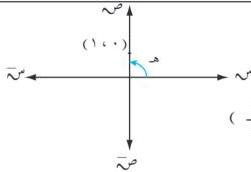

الوحدة الأولى

∴ هـ تنطبق على محور الصادات الموجب .

$$\frac{\pi}{2} = \text{هـ}$$

شكل (١ - ٩)

∴ الصورة القطبية للعدد ت = ١ (جتا $\frac{\pi}{2}$ + ت جا $\frac{\pi}{2}$ )

أو ت = [ $\frac{\pi}{2}$ , ١] .

وباعتبار (س ، ص) = (١ ، ٠) ، ∴ هـ = $\frac{\pi}{2}$

من تمثيلها البياني [انظر شكل (١ - ٩) ] .

# **مثال (١ - ١٦)**

اكتب العددين المركبين التاليين بالصورة الجبرية :

أ) ع ٤ = (جتا ٦٠ + ت جا ٦٠) . ب) ع ٢ = (جتا ١٥٠ + ت جا ١٥٠) .

# **الحل :**

أ) ع ٤ = (جتا ٦٠ + ت جا ٦٠) = ٤ ( $\frac{\sqrt{3}}{2}$ + ١) ت = ٢ + ٢√٣ ت .

ب) ع ٢ = (جتا ١٥٠ + ت جا ١٥٠) = ٢ (- جتا ٣٠ + ت جا ٣٠) = ٢ (- $\frac{\sqrt{3}}{2}$ + ١) ت =

$$= - \sqrt{3} + \text{ت} .$$

# **مقياس وسعة حاصل ضرب أو خارج قسمة عددين مركبين :**

أولاً : مقياس وسعة حاصل ضرب عددين مركبين :

بفرض ع ١ = م ١ (جتا هـ + ت جا هـ) ، ع ٢ = م ٢ (جتا هـ + ت جا هـ) .

∴ ع ١ = م ١ (جتا هـ + ت جا هـ) [ م ٢ (جتا هـ + ت جا هـ) ]

= م ١ م ٢ (جتا هـ + ت جا هـ) (جتا هـ + ت جا هـ)

= م ١ م ٢ (جتا هـ + ت جا هـ) + ت جا هـ + ت جا هـ + ت جا هـ + ت جا هـ + ت جا هـ

= م ١ م ٢ (جتا هـ + ت جا هـ) - جا هـ + ت جا هـ + ت جا هـ + ت جا هـ ]

= م ١ م ٢ [ جتا هـ + هـ + ت جا هـ + هـ ]

لأن جتا هـ + هـ = جتا هـ + ت جا هـ + ت جا هـ + ت جا هـ + ت جا هـ + ت جا هـ .

∴ مقياس (ع ١ ع ٢) = | ع ١ ع ٢ | = م ١ م ٢ = | ع ١ | | ع ٢ | .

∴ سعة (ع ١ ع ٢) = هـ + هـ .

مقياس حاصل ضرب عددين مركبين يساوي حاصل ضرب مقياسيهما .
وسعة حاصل ضرب عددين مركبين يساوي مجموع سعتيهما .

٢٦

http://www.e-learning-moe.edu.ye/