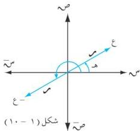
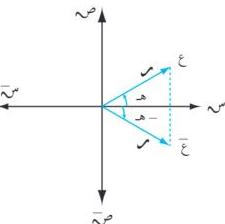
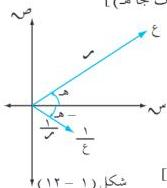

الوحدة الأولى

# الحل :

أ) ع = [م ، ه] = م (جتا ه + ت جا ه)

- ع = م (جتا ه + ت جا ه)

= م (جتا ه - ت جا ه)

= م [جتا (ه + π) + ت جا (ه + π)]

= [م ، ه + π] [انظر الشكل (١ - ١٠)]

كما سبق نلاحظ أن : | ع | = | ع | = م

سعة العدد (ع) = ه + π .

أي أن للعدد المركب (ع) ونظيره الجمعي (ع) المقياس نفسه ، بينما تزيد سعة النظير الجمعي بمقدار π .

ب) ع = م (جتا ه + ت جا ه)

∴ ع = م (جتا ه - ت جا ه)

ع = م [جتا (π ٢ - ه) + ت جا (π ٢ - ه)]

أو ع = م [جتا (ه - ه) + ت جا (ه - ه)]

[انظر الشكل (١ - ١١)]

ونلاحظ أن :

| ع | = | ع | = م .

سعة (ع) = π ٢ - ه = ه

أي أن العددين المترافقين ، لهما المقياس نفسه ويختلفان في إشارة سعتيهما .

ج) ع = م (جتا ه + ت جا ه)

∴ 1/ع = م (جتا ه + ت جا ه) / م (جتا ه - ت جا ه) [الضرب في (جتا ه - ت جا ه)]

= (جتا ه - ت جا ه) / م (جتا ه + ت جا ه) (جتا ه - ت جا ه)

= 1/م × (جتا ه - ت جا ه) / (جتا ه + جتا ه) (جتا ه - ت جا ه)

= 1/م (جتا (π ٢ - ه) + ت جا (π ٢ - ه)) [انظر الشكل (١ - ١٢)]

نلاحظ أن : | ع | = 1/م ، سعة (1/ع) = سعة (ع) = π ٢ - ه أو ه .

أي أن مقياس النظير الضريبي للعدد المركب (ع) هو 1/م بينما سعته تساوي سعة مرافق العدد المركب (ع) .

شكل (١ - ١١)

شكل (١ - ١٢)

٢٨

http://www.e-learning-moe.edu.ye/