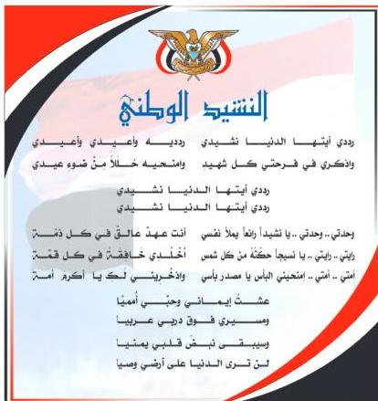

المصدر: قانون رقم (٢٦) لسنة ٢٠٠٦م بشأن السلام الجمهوري ونشيد الدولة الوطني للجمهورية اليمنية

# أعضاء اللجنة العليا للمناهج

أ.د. عبدالرزاق يحيى الأشول.

د. عبدالله عبده الحامدي. أ/ علي حسين الحيمي.
د/ صالح ناصر الصوفي. د/ أحمد علي المعمري.
أ.د/ محمد عبدالله الصوفي. أ.د/ صالح عوض عرم.
أ/ عبدالكريم محمد الجنداري. د/ إبراهيم محمد الحوشي.
د/ عبدالله علي أبو حورية. د/ شكيب محمد باجرش.
د/ عبدالله الملس. أ.د/ داوود عبدالمالك الحدابي.
أ/ منصور علي مقبل. أ/ محمد هادي طواف.
أ/ أحمد عبدالله أحمد. أ.د/ أنيس أحمد عبدالله طائع.
أ.د/ محمد سرحان سعيد الخلافي. أ/ محمد عبدالله زيارة.
أ.د/ محمد حاتم الخلافي. أ/ عبدالله علي إسماعيل.
د/ عبدالله سلطان الصلاحي.

قررت اللجنة العليا للمناهج طباعة هذا الكتاب .

http://www.e-learning-moe.edu.ye/