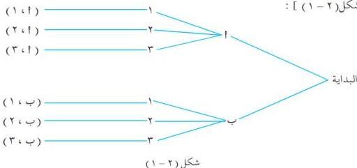

مبدأ العد ومبرهنة ذات الحدين

الوحدة الثانية

# مبدأ العد

٢ - ١

نتناول في هذا البند إحدى الطرق المفيدة في حساب عدد الطرق اللازمة لإجراء عملية ما بدون استخدام العد المباشر توفيراً للوقت والجهد ؛ فمثلاً: إذا كان لدى رجل جاك صوف وآخر من القطن ، ورمزنا لهما بالرمزين ١ ، ب ولديه كذلك ثلاثة بنطلونات من الصوف والقطن والنايلون ، ورقمناها على الترتيب ١ ، ٢ ، ٣ . ولنسأل ما عدد إمكانيات ( طرق ) اختيار جاك ثم بنطلون كبدلة يمكن للرجل لبسهما معاً .

نبدأ بعملية اختيار جاك وهي تتم بطريقتين :

اختيار الجاك ١ ، أو اختيار الجاك ب ،

ويلي ذلك عملية اختيار بنطلون ، وهي تتم بثلاث طرق :

اختيار البنطلون ١ ، أو اختيار البنطلون ٢ ، أو اختيار البنطلون ٣ .

ويمكن الحصول على نواتج العملية المركبة من العمليتين السابقتين المتتاليتين كما في المخطط الشجري التالي

[ انظر شكل (٢ - ١) ] :

شكل (٢ - ١) نلاحظ أن طرق اختيار جاك ثم بنطلون هي الأزواج المرتبة التالية :

( ١ ، ٢ ) ، ( ٢ ، ٣ ) ، ( ٣ ، ١ ) ، ( ١ ، ٢ ) ، ( ٢ ، ٣ ) ، وأن عدد

طرق ( إمكانيات ) إجراء العمليتين معاً يساوي عدد طرق العملية الأولى مضروباً في عدد طرق العملية الأخرى

ويساوي ٢ × ٣ = ٦ طرق .

# تدريب (٢ - ١)

لتكن س = { ١ ، ٢ ، ٣ ، ٤ } ، كم عدداً مكوناً من رقمين مختلفين يمكن تشكيله من هذه المجموعة؟

وضّح ذلك بمخطط شجري .

٤٥

http://www.e-learning-moe.edu.ye/