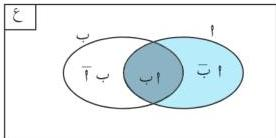

الاحتمالات

∴ حا (ع) = حا (t) + حا (t)
∴ حا (ع) = ١
∴ ١ = حا (t) + جا (t)
ومنها حا (t) = ١ - جا (t)

# مبرهنة (٣ - ٣)

لأي حادثتين t ، ب ⊖ تكون : حا (tب) = حا (t) - حا (tب) .

البرهان : من الشكل (٣-١) نلاحظ أن :

t = t ∪ 1ب

وعليه : حا (tب ∪ 1ب) = حا (t)

∴ tب ∪ 1ب = ∅

∴ حا (t) = حا (tب) + حا (tب)

ومنها حا (tب) = حا (t) - حا (tب) .

شكل (٣-١)

# نتيجة (١) :

إذا كانت t ، ب حادثتين متنافيتين فإن :

حا (tب) = حا (t) ، حا (ب) = حا (ب) .

# تدريب (٣ - ١)

برهن النتيجة (١) .

# نتيجة (٢) :

لأي حادثتين t ، ب ⊖ ، ب ⊖ t فإن :

(١) حا (tب) = حا (t) - حا (ب)

(٢) حا (ب) ≥ حا (t)

البرهان : ١) ∴ ب ⊖ t ∴ tب = ب

∴ حا (tب) = حا (ب)

∴ حا (tب) = حا (t) - حا (tب) (مبرهنة ٣-٣)

∴ حا (tب) = حا (t) - حا (ب)

٧٥

http://www.e-learning-moe.edu.ye/