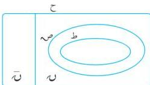

الوحدة الأولى

الأعداد المركبة

# العدد المركب

١ - ١

عرفت فيما سبق أن هناك مجموعات عددية مختلفة، منها :
مجموعة الأعداد الطبيعية (ط) ، ومجموعة الأعداد
الصحيحة (ص) ، والنسبية (س) ، والحقيقية (ح) .
ولاشك أنك تتذكر العلاقة بينها. تأمل الشكل (١ - ١) ؛
تلاحظ أن : ط ⬜ ⬜ ⬜ ⬜ ⬜ .
ح = س ⬜ (س) مجموعة الأعداد غير النسبية

شكل (١ - ١)

# تدريب (١ - ١)

أوجد حلول المعادلات التالية ، وأذكر إلى أي مجموعة تنتمي هذه الحلول :

س + ٢ = ٨ ، س = ١ ، س = ٢ ، س = ١ + ٠ .

من حل التدريب تلاحظ : س + ٢ = ٨ ← س = ٦ ، س = ٦ - ٦ ،

لكن ٦ - ٦ = ٦ ؛ أي أن هذه المعادلة ليس لها حل في ط ، ولها حل في ص .

والمعادلة س = ١ ← س = ١/٢ ، ليس لها حل في ص ، ولكن لها حل في س .

أما المعادلة س = ٢ ← س = ٢/٢ ليس لها حل في س ؛ وإنما لها حل في ح .

وعند حل المعادلة : س = ١ + ٠ نجد أن :

س = ١ + ٠ ← س = ١ - ٢ ← س = ١ - ٢ . فما قيمة ١ - ٢ ؟

تعلم أنه لا يوجد عدد حقيقي مربعه = ١ - ١ .

إذن ليس للمعادلة الأخيرة حل في ح ؛ وللوصول إلى حل مثل هذه المعادلات جاءت الحاجة إلى توسيع
مجموعة الأعداد الحقيقية ، بحيث تكون كل معادلة من الدرجة الثانية قابلة للحل في هذه المجموعة ؛ ونطلق على
هذه المجموعة مجموعة الأعداد المركبة .

بما أن الجذور التربيعية للأعداد السالبة لا يمكن أن تكون أعداداً حقيقية ، لذا تسمى أعداداً تخيلية ، يرمز لها
بالرمز ت (الحرف الأول من كلمة تخيلي) ليدل على الجذر التربيعية للعدد ١ - ١ ، أي :

ت = ١ - ٢

ت × ت = ١ - ٢ × ١ - ٢ = ١ - ٢ أي أن : ت = ١ - ٢

ت = ٢ × ت = ١ - ٢ × ت = ١ - ٢ .

٧

http://www.e-learning-moe.edu.ye/