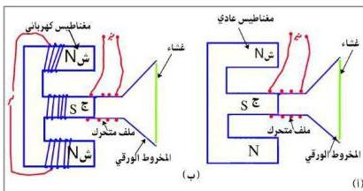

- ثم تمرر هذه التيارات التأثيرية مختلفة التردد على دائرة الرنين، حيث يتم انتقاء تردد المحطة المراد سماعها، وذلك بتغيير تردد دائرة الرنين حتى يتفق مع تردد موجات المحطة المطلوبة، وتسمى هذه العملية بعملية التوليف (Tunning).
- يقوم التيار الذي تسمح بمروره دائرة الرنين ويكبر.
- يفصل التيار الحامل عن التيار المعبر عن الصوت.
- يمر التيار المعبر عن الصوت في السماعة، فيحدث صوتاً مشابه للصوت في استوديو محطة الإذاعة، أنظر إلى الشكل (٩).

### مكبر الصوت الديناميكي في الراديو :

- وهو السماعة المستخدمة لتكبير الصوت في الراديو.
- ثم يتركب ؟ لكي تتعرف على تركيبه.. نفذ الآتي:
- قم بزيارة إلى أقرب ورشة فنية متخصصة في صيانة أجهزة الراديو واطلب من المختص أن يريك هذا المكبر ... .
- تفحص شكله وتعرف على الأجزاء التي يتكون منها. ارسم واكتب تقريراً مختصراً عنه.

### تركيب مكبر الصوت :

يتركب مكبر الصوت من ملف من سلك نحاسي معزول وملفوف حول إسطوانة صغيرة من الورق المقوى مثبتة عند رأس مخروط أجوف من الورق المقوى، وتثبت حافة قاعدة المخروط

في واجهة جهاز الراديو خلف جزء مشقب، بينما يقع الملف في فجوة إسطوانية بين قطبي مغناطيس عادي، أنظر الشكل (١٠-١) أو بين

شكل (١٠) : تركيب مكبر الصوت

٩٨

http://www.e-learning-moe.edu.ye/