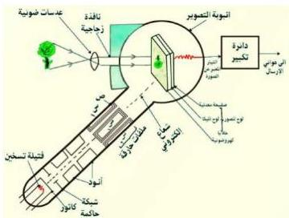

شبكة الإرسال التلفازي؟ وكيف تتم عملية الإرسال؟

تبدأ عملية الإرسال التلفازي، بأخذ صورة للمنظر أو المشهد المراد إرساله تلفزيونياً، وذلك بواسطة آلات (كاميرات) التصوير التلفازي، ومن أنواع الكاميرات التلفزيونية، الكاميرا التي تسمى الإيكونوسكوب **Iconoscope**، والتي تتكون من أربعة أجزاء أساسية (انظر الشكل «١١») هي:

١ – أنبوبة التصوير: وهي عبارة عن أنبوبة مظلمة مخلخلة من الهواء لها نافذة زجاجية في مقدمتها مجموعة من العدسات.

٢ – لوح الصورة (أو لوح الإشارات)، ويوجد داخل أنبوبة التصوير، وتتكون من لوح رقيق جداً من الميكا **Mica** (الميكا مادة شبه زجاجية، يمكن أن تشطر إلى رقاقات وتستعمل عازلاً كهربائياً)، يغطي سطح لوح الميكا المقابل للعدسات عدة آلاف من الخلايا الكهروضوئية المعزولة بعضها عن بعض، وكل خلية عبارة عن حبيبة صغيرة جداً من الفضة تغطيها طبقة من السيزيوم، إذا سقطت عليها أشعة ضوئية فإنها تبعث بإلكترونات، ويسمى اللوح بلوح الموزاييك (**Mosaic**) ويغطي السطح الآخر للوح الميكا **Mica** صفيحة معدنية رقيقة متصلة بمكبر تيار الصورة.

٣ – بندقية إلكترونية (:**Electrons Gun**) عبارة عن إسطوانة ضيقة تحتوي في طرفها الخارجي على كاثود (مهبط) باعث للإلكترونات، وتحيط به شبكة حاكمة للتحكم في عدد وتركيز الإلكترونات المتجهة من الكاثود إلى لوح

الصورة، ويوجد أمام الشبكة أنود (مصعد) يُحمل بجهد موجب (أي جهده موجب)، تزداد قيمة هذا الجهد من طرف الأنود القريب من الشبكة إلى طرفه القريب من لوح الصورة بالتدريج.

شكل (١١) الإيكونوسكوب

١٠٠

<http://www.e-learning-moe.edu.ye/>