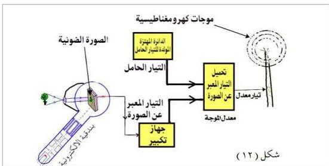

ووظيفة الأنود تركيز وتسارع الإلكترونات نحو طبقة الخلايا الكهروضوئية كحزمة ضيقة جداً ومركزة تسمى الشعاع الإلكتروني.

٤ - ملفات (أو ألواح) تحريك شعاع الكاثود: وتسمى كذلك بالملفات الحارقة Deflection coils، وهي عبارة عن زوجين من الملفات (أو الألواح) المتعامدة

(س₁، س₂)، ومحورهما المشترك رأسي و (ص₁، ص₂)، ومحورهما المشترك أفقي.

فإذا مرَّ في هذه الملفات تيار كهربائي يتولد عنه مجال مغناطيسي يعمل على تحريك الشعاع الإلكتروني بالكيفية المطلوبة لمسح لوح الصورة.

ويقصد بعملية الإرسال التلفازي بأنها عملية إرسال صور الأشياء المراد مشاهدتها بعد تحويل هذه الصور (من طاقة ضوئية) إلى طاقة كهربائية وتحميلها على موجات كهرومغناطيسية عالية التردد تنتشر في الهواء الجوي في جميع الاتجاهات، فكيف تتم عملية الإرسال؟

### عملية إرسال الصور تلفازياً

عند تصوير الشيء أو المنظر المراد إرسال صورته تلفازياً، يضاء هذا الشيء أو المنظر أو المشهد إضافة شديدة فتقوم العدسات الموجودة في كاميرا التصوير بتكوين صورة ضوئية له على لوح الخلايا الكهروضوئية التي بدورها تثار ضوئياً وتبعث بعدد من الإلكترونات، وتختلف عدد الإلكترونات المنبعثة باختلاف كمية الضوء الساقط عليها، وعندئذ تشحن الخلايا بشحنات موجبة مساوية لما فقدته من إلكترونات، فتؤثر هذه الشحنات على الصفيحة المعدنية الموجودة على الوجه

١٠١

http://www.e-learning-moe.edu.ye/