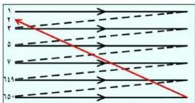

الآخر للوح الميكافنتكون عليها شحنات سالبة مساوية لعدد الشحنات الموجبة التي على الخلايا الكهروضوئية.

تطلق البندقية الإلكترونية الشعاع الإلكتروني على لوح الخلايا الكهروضوئية عند نقطة تسمى نقطة الاستكشاف حيث يمدها الشعاع الإلكتروني بشحنات سالبة عددها مساوٍ لعدد الإلكترونات التي فقدتها الخلايا نتيجة تكون الصورة الضوئية عليها، وبذلك تتعادل هذه الخلايا كهربائياً. ونتيجة لتعادل شحنات الخلايا، تتحرر الشحنات السالبة (الإلكترونات) التي على الصفيحة المعدنية، وتنطلق على هيئة نبضات كهربائية مختلفة التردد إلى جهاز التكبير وإلى باقي أجزاء جهاز الإرسال (شبكة الإرسال).

### عملية المسح التلفازي :

شكل (١٣)

كيف يقوم الشعاع الإلكتروني بعملية المسح التلفازي للصورة المكونة على لوح الخلايا الكهروضوئية؟ وما الدور الذي تقوم به الملفات الحارقة في عملية المسح هذه؟

عندما يمر تيار كهربائي في الملفات الحارقة (س١، س٢) و (ص١، ص٢) تتولد مجالات مغناطيسية يمكن تغييرها بنظام معين بحيث يتحرك الشعاع الإلكتروني، وتتحرك نقطة الاستكشاف على لوح الخلايا ماسحة الخلايا الكهروضوئية صفاً صفاً ابتداءً من اليسار إلى اليمين (انظر الشكل «١٣»)، أي تبدأ بالصف الأول ثم الثاني ثم الثالث وهكذا حتى تصل إلى الصف رقم ٦٥٠، وتتم عملية مسح الصورة لجميع الصفوف للمرة الواحدة في زمن قدره $\frac{1}{25}$ من الثانية، وكلما تم مسح الصورة مرة تتكون صورة ضوئية جديدة على لوح الصورة بالطريقة السابقة نفسها.

ونتيجة لعمليات المسح تنطلق الإلكترونات من الصفيحة المعدنية، مكونة التيار المعبر عن الصورة الذي يمر إلى جهاز التعديل حيث يُحمل على التيار الحامل الذي تنتجه الدائرة المهتزة، وبالتالي يتكون ما يسمى بالتيار المعدل (التيار المعدل = التيار المعبر عن الصورة + التيار الحامل) الذي بدوره يتجه إلى هوائي الإرسال Antenna حيث تتحول التيارات المعدلة إلى موجات كهرومغناطيسية تنتشر في الهواء الجوي في جميع الاتجاهات (انظر الشكل «١٢»).

١٠٢

http://www.e-learning-moe.edu.ye/