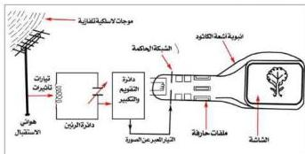

## الاستقبال التلفازي Television Waves Reception

تحتاج عملية الاستقبال التلفازي إلى جهاز استقبال (شبكة استقبال)، فماذا يقصد بعملية الاستقبال التلفازي؟ وممّ يتركب جهاز الاستقبال؟ وكيف تتم عملية الاستقبال التلفازي؟ لكي تتعرف على ذلك نفذ الآتي:

- قم بزيارة إلى أقرب ورشة إلكترونية متخصصة في صيانة الأجهزة الإلكترونية وبالذات أجهزة التلفاز.
- قابل المهندس أو الفني المتخصص، واطلب منه ما يأتي:
- أن يشرح لك - باختصار - كيفية استقبال الإرسال التلفازي بواسطة جهاز الاستقبال - مستعيناً في ذلك - برسم تخطيطي مبسط لمراحل الاستقبال التلفازي.
- أن يتركب كلاً من دائرة الرنين (دائرة التوليف) **Tunning** ودائرة التكبير والشاشة (أنبوبة أشعة الكاثود) وزوجي الملفات الحارقة المحيطة بأنبوبة الكاثود من الخارج.

**تحذير:** لا تفتح أي جهاز تلفاز: لأن في ذلك خطورة عليك - حيث تُخزّن أجهزة التلفاز شحنات كثيرة وفولتات عالية أثناء تشغيله وبعد غلقه]

يقصد بعملية الاستقبال التلفازي، بأنها عملية استلام الموجات الكهرومغناطيسية المرسلة من محطة الإرسال، وتحويلها إلى طاقة كهربائية ومن ثم تحويل هذه الطاقة الكهربائية إلى طاقة ضوئية (صورة ضوئية)، وذلك بواسطة شبكة الاستقبال التلفازي (جهاز الاستقبال).

## جهاز الاستقبال التلفازي (شبكة الاستقبال التلفازي)
TV Receiver Set

شكل (١٤)

يتركب جهاز الاستقبال التلفازي، كما هو موضح في الشكل (١٤) في أبسط صورة له من الأجزاء الأساسية الآتية:

- دائرة هوائي الاستقبال.
- دائرة الرنين.
- دائرة التقويم والتكبير.
- أنبوبة أشعة الكاثود قاعدتها المخروطية تسمى الشاشة وتغطي الشاشة من الداخل

١٠٣

http://www.e-learning-moe.edu.ye/