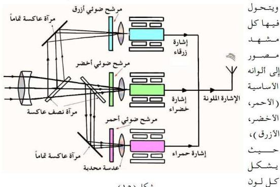

## Coloured Television التلفاز الملون

في التلفاز الملون يتم إرسال الصور واستقبالها بالألوان الثلاثة الأساسية (أو الأولية) وهي الأحمر Red، والأخضر Green، والأزرق Blue، كما يتم التصوير خلال مرشحات لهذه الألوان. انظر الشكل « ١٥ ».

إن الضوء المنعكس من الجسم أو المنظر المراد تصويره بواسطة كاميرا التلفاز الملون يحلل أو يقسم بواسطة مرشحات إلى ثلاثة ألوان أولية هي الأحمر، والأخضر والأزرق وتستخدم لذلك أنواع خاصة من المرايا والمرشحات (يقصد بالمرشح بأنه عبارة عن غشاء رقيق ملون لا يسمح بنفاذ الضوء من خلاله إلا للضوء الذي يماثله في اللون)، ثم يرسل كل لون إلى أنبوبة مستقلة موجودة في كاميرا التصوير،

شكل (١٥)

من هذه الألوان إشارة تلفازية مستقلة.

بعد ذلك، ترسل هذه الإشارات (الموجات) إلى ثلاث بندقيات للإلكترونات (قاذفات الإلكترونات) أو مدافع إلكترونية موجودة في أنبوبة أشعة الكاثود التي في جهاز الاستقبال التلفازي، يعطي كل منها حزمة من الإلكترونات (شعاع إلكتروني)، تتجمع على لوحة فيها عدد كبير من الثقوب تسمى «قناع الظل» ويليهما ستارة

١٠٥

http://www.e-learning-moe.edu.ye/