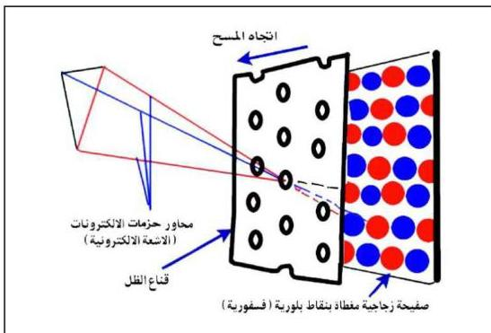

(لوحة) عليها عدد كبير أيضاً من النقاط الفلوريسية يساوي عدد الثقوب على اللوحة متجمعة في ثلاث مجموعات مرتبة في ترتيب معين : انظر الشكل (١٦).

فعندما تقوم الإلكترونات بتحفيز هذه النقاط، ترسل كل منها ضوءاً ملوناً بأحد الألوان الثلاثة المذكورة تختلف شدته باختلاف حزمة الإلكترونات (شدة الشعاع الإلكتروني) المسببة له.

وعندما تقوم حزم الإلكترونات بمسح قناع الظل كله، فإنها تتفرق عبر كل ثقب فتصطدم الحزمة الإلكترونية الحاملة لإشارة اللون الأحمر بالنقاط الفلوريسية المصدرة للون الأحمر، وذلك ضمن عملية تركيز بؤري دقيق تتكرر بالنسبة لبقية الألوان (الأضواء الملونة)، ومع تغير شدة الشعاع الإلكتروني لكل حزمة، يتغير اللون التابع لها، الأمر الذي يولد من جديد جميع الألوان الأساسية للمشهد أو المنظر المصور والمرسل تلفازياً.

شكل (١٦)

١٠٦

http://www.e-learning-moe.edu.ye/