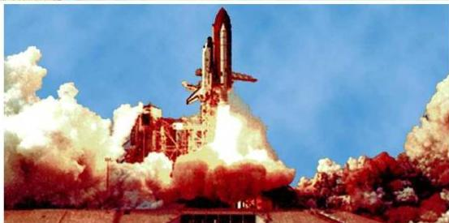

# كمية التحرك والمقذوفات
Momentum and Projectiles

# الوحدة
الأولى

صورة لمكوك الفضاء الأمريكي قبل انطلاقه بثوانٍ إلى الفضاء وتظهر غازات مصحوبة
بضوء تنطلق من مؤخرة السفينة (المكوك)

# أهداف الوحدة

يتوقع من الطالب بعد الانتهاء من دراسة هذه الوحدة أن يكون قادراً على أن :

١- يعرف المفاهيم الآتية:
القمر الصناعي ، سرعة الإفلات من الجاذبية ، كمية التحرك الزاوي ، بقاء
كمية التحرك الزاوي وحركة المقذوفات .
٢- يوضح مفهوم التصادم في بعدين .
٣- يستنتج قانون التصادم في بعدين .
٤- يحسب سرعة القمر الصناعي اللازمة لاستمراره في مداره .
٥- يوضح المقصود بالصواريخ ذاتية الدفع، وفيما تستخدم .
٦- يبين معنى مفهوم سرعة الإفلات من الجاذبية الأرضية .
٧- يذكر العلاقة بين عزم القصور الذاتي الدوراني والسرعة الزاوية .
٨- يفرق بين نوعي الحركة التي تتحرك بها المقذوفات
٩- يحل المسائل ذات العلاقة في هذه الوحدة .

٩

http://www.e-learning-moe.edu.ye/