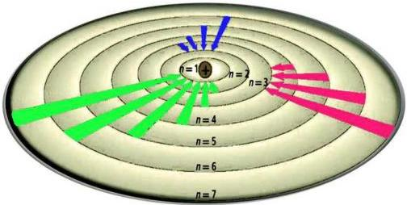

[LOGO]

# الفيزياء الذرية

Atomic Physics

الوحدة
الخامسة

## أهداف الوحدة

يتوقع من الطالب بعد الانتهاء من دراسة هذه الوحدة أن يكون قادراً

على أن:

١- يوضح ما المقصود بكل من: الطيف المتصل، والطيف الخطي، وخطوط

الامتصاص، وسلاسل الطيف لذرة الهيدروجين، والجسم الأسود.

٢- يعرف نماذج تومسون ورذرفورد ويذكر عيوبهما.

٣- يشرح مبدأ بلانك في تكميم طاقة الإشعاع.

٤- يشرح فرضيات بوهر ومبرراتها.

٥- يوضح نجاحات وإخفاقات نظرية بوهر.

٦- يحل التمارين المتعلقة بمواضيع هذه الوحدة.

١١٤

http://www.e-learning-moe.edu.ye/