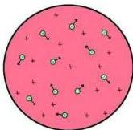
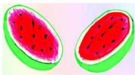

شكل (١)

١- الذرة متعادلة كهربائياً .
٢- الأيونات الموجبة لها تقريباً نفس كتلة الذرة .
٣- الإلكترونات السالبة أخف بكثير من الأيونات الموجبة .
هذه الملاحظات والحقائق العلمية أدت بالعالم تومسون إلى إعلان أول نموذج للذرة عام ١٩٠٤م، وينص على أن :

«الذرة شبيهة بكرة مصمتة تتوزع بداخلها الشحنات الموجبة بانتظام وتتخللها الإلكترونات السالبة بحيث يكون مجموعها مساوياً للشحنة الموجبة» .

شكل (٢)

وقد سمي هذا النموذج بفطيرة البرقوق، شكل (١)، ويمكن تصوره أيضاً كالبطيخة، المادة الحمراء فيها هي الشحنة الموجبة والبذور السوداء التي تتخللها هي الإلكترونات انظر الشكل (٢) .

وكان لهذا النموذج الذري آنذاك بعض المزايا، منها أن تصور الذرة على أنها عبارة عن كرة صغيرة مصقولة مرنة كانت خاصية ضرورية لتفسير النظرية الحركية للغازات .

وقد عهد تومسون لأحد طلابه وهو (رذر فورد) أن يختبر صلاحية هذا النموذج . وقبل التعرف على عيوب (هذا النموذج) لا بد أن نتعرف أولاً على بعض المشاهدات التجريبية لبعض العناصر الكيميائية .

### إثارة العناصر الكيميائية :

عندما يُقذف غاز العنصر في أنبوب الأشعة المهبطية بحزمة من الإلكترونات ذات طاقة معينة فإن ذراته قد تمتص جزءاً من طاقة الإلكترون أو كل طاقته نتيجة للتصادم . في هذه الحالة نقول إن ذرات العنصر قد أثبتت بطريقة الصدمة الإلكترونية . وقد تُثار الذرة بطريقة امتصاص الإشعاع أو بطريقة التسخين . ثم ما يلبث العنصر المثار (أي ذراته المثار) أن يعود تلقائياً إلى حالته الأولى وذلك بإطلاق الطاقة التي امتصها على شكل إشعاع ضوئي .

١١٦

http://www.e-learning-moe.edu.ye/