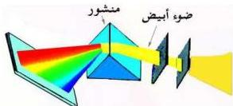
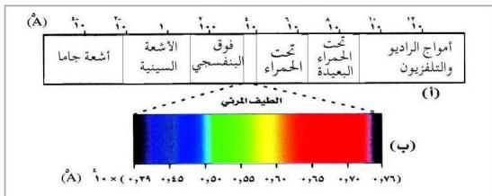

## طيف المصادر الضوئية :

إن ضوء عدد كبير من المصادر الضوئية كالأثوار المتوهجة أو الشمس يمثل طيفاً متصلاً، أي يحوي جميع الأطوال الموجية بشكل مستمر (متصل)، ويتضح ذلك عندما نمر حزمة ضوئية لمصدر ضوئي خلال منشور ثلاثي فيحللها إلى ألوان الطيف الأساسية وهي (الأحمر والبرتقالي والأصفر والأخضر والأزرق والنيلي والبنفسجي)، كما هو مبين في الشكل (٣).

شكل (٣)

وفيما يتعلق بطيف الشمس فهو طيف متصل ويحتوي على جميع الأطوال الموجية الضوئية المرئية وغير المرئية والجزء الأكبر منها غير مرئي، انظر

الشكل (٤ أ). ستلاحظ أن طيف الشمس يحتوي على الأشعة تحت الحمراء وفوق البنفسجية والأشعة السينية وأشعة جاما وأمواج الراديو والتلفزيون وغيرها من الأشعة ذات الأمواج الطويلة والقصيرة غير المرئية.

أما الجزء المرئي فهو جزء صغير جداً من الطيف الكلي للشمس ويمثله الشريط الأبيض الذي يتوسط الطيف. والشكل (٤ ب) صورة مكبرة لهذا الجزء المرئي وهو عبارة عن مزيج من الألوان على شكل طيف متصل تتغير فيه الألوان تدريجياً من اللون الأحمر إلى اللون البنفسجي (ألوان قوس قزح) (شكل ٣).

شكل (٤)

١١٧

http://www.e-learning-moe.edu.ye/