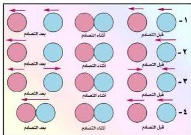

## كمية التحرك : Momentum

درسنا في الصف العاشر مفهوم كمية التحرك الخطي (كت) لجسم متحرك كتلته (ك) وسرعته (ع) فوجدنا أن كمية التحرك الخطي للجسم تساوي كتلة الجسم في سرعته أي أن كمية التحرك (كَت) = ك × ع

كما عرفنا أن كمية تحرك أي جسم تكون كمية متجهة ويكون اتجاهها باتجاه سرعة الجسم المتحرك. وتظل كمية التحرك لجسم ثابتة طالما ظلت سرعة الجسم وكتلته ثابتتين، وتتغير تبعاً لتغير الكتلة أو السرعة أو كليهما، كما أنها تنتقل من جسم إلى آخر كما درسنا أيضاً مبدأ حفظ كمية التحرك الخطي الذي ينص على أن: «كمية التحرك الكلية للأجسام المتصادمة قبل التصادم تساوي كمية التحرك الكلية لها بعد التصادم».

### التصادم في بُعدين Two - Dimensional Collisions

من دراستنا أيضاً لمفهوم كمية التحرك الخطي في الصف العاشر عرفنا مفهوم التصادمات، وأن التصادم نوعان هما:

- التصادم المرن Elastic Collision : وفيه تكون مجموع الطاقة الحركية للأجسام المتصادمة قبل التصادم مساوية لمجموع الطاقة الحركية لها بعد التصادم.
- التصادم غير المرن : Inelastic Collision : وفيه يكون مجموع الطاقة الحركية للأجسام المتصادمة بعد التصادم لا يساوي مجموع طاقتها الحركية قبل التصادم، وفي كلا الحالتين ينطبق قانون حفظ كمية التحرك ويكون على النحو الآتي:

شكل (١)

- مجموع كمية التحرك للأجسام المتصادمة قبل التصادم = مجموع كمية التحرك لها بعد التصادم
- وفي هذه الوحدة سندرس التصادم في بُعدين.
- ما التصادم في بُعدين ؟
- لاحظ النماذج في الشكل (١):
- صف التصادم الحادث بين

١٠

http://www.e-learning-moe.edu.ye/