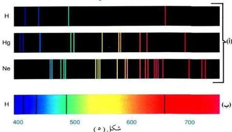
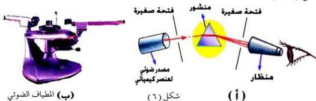

## طيف العناصر الكيميائية :

هناك مصادر ضوئية أخرى أطيافها ذات مظاهر مختلفة، فالطيف الذي تشعه العناصر الكيميائية المثارة عبارة عن طيف خطي (غير متصل)، أي يحتوي على عدد محدود من الأطوال الموجية وأبسط هذه الأطياف طيف عنصر الهيدروجين. ويبين الشكل (٥ أ) أطياف الانبعاث الخطي لعناصر الهيدروجين (H) والزرنيخ (Hg) والنيون (Ne) للأطوال الموجية مقاسة بالنانو متر (حيث ١ نانومتر = ١٠⁻⁹ متر). بينما يبين الشكل (٥ ب) طيف الانبعاث الخطي لعنصر الهيدروجين.

لقد أثبت العالم الألماني كيرتشوف عام ١٨٥٩، بأن العناصر الكيميائية عندما تثار بالتسخين فإنها تشع نفس الألوان (نفس الأطوال الموجية) التي تمتصها وأن لكل عنصر لون (طول موجي) خاص يمتصه. وقد استخدمت هذه الخاصية في القرن التاسع عشر للكشف عن المعادن والتمييز بينها. ويبين الشكل (٦ أ) بأن الضوء المنبعث من عنصر كيميائي هو طيف خطي بعد تحليله عبر منشور، ويتكون من ثلاثة خطوط أي من ثلاثة أطوال موجية في حالة هذا العنصر. وهذا الشكل هو مخطط للمبدأ الذي يقوم عليه جهاز مقياس الطيف (المطياف) الذي يظهر في الشكل (٦ ب).

١١٨

<http://www.e-learning-moe.edu.ye/>