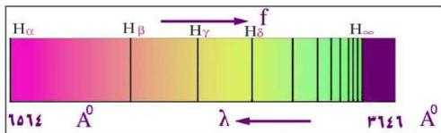

## خطوط الامتصاص لذرة الهيدروجين :

لو مررنا حزمة من الضوء الأبيض على حجم من غاز الهيدروجين، ثم حللنا الضوء الذي اجتاز الهيدروجين بواسطة مقياس الطيف، نلاحظ أننا نتلقى نفس طيف الضوء الأبيض الذي أسقطناه على غاز الهيدروجين، ولكن ضمن سلسلة من خطوط داكنة. هذه الخطوط هي الأطوال الموجية التي امتصها غاز الهيدروجين ولذلك تسمى هذه الخطوط بخطوط طيف الامتصاص.

والأطوال الموجية لهذه الخطوط تنطبق تماماً مع الأطوال الموجية لخطوط الانبعاث لذرات الهيدروجين، انظر الشكل (٥ ب) وقارنه بطيف الانبعاث الخطي لعنصر الهيدروجين في الشكل (٥ أ). إذاً، ذرات غاز الهيدروجين لا تمتص من طيف الضوء الساقط عليها إلا أطوال موجية محددة بدقة وتدع الأطوال الموجية الأخرى تمر وما تلبث أن تشع نفس الأطوال الموجية التي امتصتها.

### طيف ذرة الهيدروجين : The Hydrogen Spectrum

لقد أحدث الانبعاث الطيفي للعناصر الكيميائية مشاكل مختلفة، إذ وجد العلماء أن الطيف لأي عنصر يتألف من أطوال موجية، توحي بانتظام وتناسق محددين بحيث يمكن أن تصنف في مجموعات سميت بسلاسل الأطياف. هذا الأمر جعل العلماء يجتهدون في صياغة النظريات حول البنية الداخلية للذرة. فبنظرة إلى طيف ذرة الهيدروجين نجد أن خطوطه تظهر في تراتيب معينة. إذاً، ما هي الخصائص المميزة لهذه التراتيب المتناظرة المنتظمة؟ فالفرق في الأطوال الموجية بين مختلف الخطوط يتناقص بسرعة كلما اتجهنا نحو الموجات الأقصر [انظر الشكل (٧) الذي يمثل طيف ذرة الهيدروجين].

شكل (٧)

هذا الأمر جعل العلماء يفكرون بأنه من الممكن التعبير عن هذه الخطوط الطيفية بسلسلة من نوع السلاسل الجبرية أو الهندسية ولكن لسوء الحظ لم توجد أية سلسلة

١١٩

http://www.e-learning-moe.edu.ye/