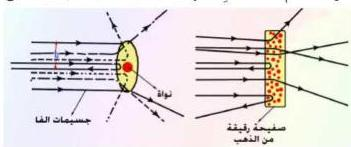
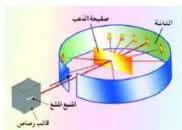

ففي عام (١٩٠٩م) قام العالم البريطاني (رذرفورد) بتجربته المشهورة وهي قذف صفيحة رقيقة جداً من الذهب سمكها ١٠⁻³م بحزمة من جسيمات ألفا (وقد عرفت فيما بعد بأنها أيونات الهيليوم الموجبة He⁺⁺) المطلقة بطاقة عالية من مصدر مشع، كالراديوم، موضوع في قالب من الرصاص (لماذا من الرصاص ؟). هذه الجسيمات عند اصطدامها بالصفيحة تتشتت وتضطدم بشاشة إسطوانية مطلية بطبقة رقيقة من

شكل (٩)

شكل (٨)

كبريتيد الزنك (ZnS) لها خاصية الوميض عند اصطدام جسيمات ألفا بها، انظر الشكل (٨).

في إطار نموذج تومسون الذري، الذي يفترض أن الكتلة والشحنة للذرات تتوزع بشكل منتظم داخل حجم الذرة، من المتوقع أن تعاني جسيمات ألفا انحرافاً مقداره حوالي ٠.٠١ من الدرجة إذا كان هذا الانحراف ناتجاً عن قوى التصادم بين جسيمات ألفا الموجبة والإلكترونات السالبة (لماذا ؟)، أما إذا كان الانحراف ناتجاً عن قوى التنافر الكهربائي بين شحنات ألفا الموجبة والشحنة الموجبة للذرة فإنه لا يمكن أن يتجاوز ٠.٢٥ من الدرجة.

ولكن التجربة دلت على نتائج مذهشة، إذ لوحظ أن معظم جسيمات ألفا تجتاز الصفيحة دون أن تقابل أي مانع في طريقها تضطدم به، وأن عدداً قليلاً منها حوالي واحدة من بين (٨٠٠٠) جسيمة هي التي تتشتت ضمن زوايا أكبر من ٩٠ درجة وقد تصل إلى ١٨٠ درجة أي ترتد على نفسها، انظر الشكل (٩).

### نموذج (رذرفورد) (Rutherford Nuclear Model of the Atom)

نتيجة للتجربة التي أجراها العالم البريطاني إيرنست رذرفورد عام ١٩٠٩م والنتائج التي حصل عليها، فقد تصور نموذجاً للذرة قادراً على أن يفسر هذه النتائج، إذ فرض أن الشحنة الموجبة للذرة ومعظم كتلتها (لماذا لا تكون كل كتلتها ؟) تتركز

١٢١

http://www.e-learning-moe.edu.ye/