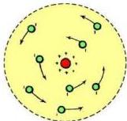
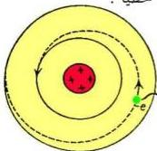

في حجم صغير جداً في مركز الذرة سماه النواة، وهذا يفسر ارتداد عدد قليل من جسيمات ألفا. وأن الإلكترونات ذات الشحنة السالبة تتوزع حول النواة في مدارات شبيهة بمدارات الكواكب السيارة في النظام الشمسي، بحيث تتعادل شحنتها السالبة مع الشحنة الموجبة للنواة. وبما أن حجم الإلكترون صغير جداً بالنسبة لأبعاد الذرة، فيمكن أن يعتبر معظم حجم الذرة المحيط بالنواة فراغاً، وهذا يفسر لماذا معظم جسيمات ألفا الساقطة على الصفيحة الذهبية تجتازها دون أن تعاني من أي انحراف. وهكذا فهذا النموذج وطُعد نفسه وأصبح يعرف بالنظام النووي، والشكل (١٠) يبين صورة تخيلية تقريبية لهذا النموذج.

### عيوب نموذج (رذرفورد) :

شكل (١٠)

وفقاً لهذا النموذج، لا يمكن أن تكون الذرة مستقرة من وجهة نظر الفيزياء الكلاسيكية، لأنه إذا كان الإلكترون في ذرة الهيدروجين يتحرك حول النواة حركة دائرية فإن شحنته (سم) تتعجل وبالتالي فإنها يجب أن تشع طاقة باستمرار بحسب ما تنص عليه النظرية الكهرومغناطيسية، أي أن ذرة الهيدروجين يجب أن تبعث طيفاً مستمراً (متصلاً). وفي هذه العملية الإشعاعية المستمرة لابد أن يفقد الإلكترون طاقته تدريجياً وفي النهاية ينهار ويسقط على النواة مندمجاً معها، انظر الشكل (١١).

ولكن هذا مخالف للواقع ولم يحدث مثل هذا الاندماج. فذرة الهيدروجين ذرة مستقرة وأكثر من ذلك فهي لا تشع طيفاً متصلاً وإنما طيفاً خطياً.

شكل (١١)

فهذا يعتبر عجزاً آخر للفيزياء التقليدية في عدم استطاعتها تفسير الظواهر الذرية.

فوتون ضوئي hf

لذلك فنظرية (رذرفورد) هذه لا يمكن قبولها، ولا بد

من البحث عن نظرية أخرى تحل هذه المعضلة، نظرية فذة جديدة لها من الجديد كما كان لنموذج

(رذرفورد) نفسه حين وضع النموذج النووي للذرة. وهذا ما فعله بلانك حين افترض تكميم الطاقة الإشعاعية.

١٢٢

http://www.e-learning-moe.edu.ye/