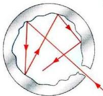
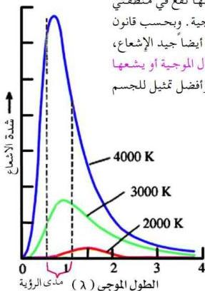

## إشعاع الجسم الأسود Blackbody Radiation

شكل (١٢)

الجسم الساخن في أية درجة حرارة فوق درجة الصفر المطلق يبعث إشعاعاً يدعى أحياناً الإشعاع الحراري. خواص هذا الإشعاع تعتمد على نوع مادة الجسم ودرجة حرارته. ففي درجة الحرارة المنخفضة، تقع الأطوال الموجية المنبعثة للإشعاع الحراري بشكل رئيسي في منطقة الأمواج تحت الحمراء، فهي لا ترى بالعين المجردة، ولهذا يظهر الجسم في بداية التسخين

معتماً. وعندما تزداد درجة حرارته يبدأ بالتوهج بلون يميل إلى الأحمر فالبرتقالي، وعندما تصل درجة حرارته حداً معيناً يصبح توهج الجسم أبيض، أي يصبح الجسم يشع أطوالاً موجية تقع في منطقة الطيف المرئي. وتدل الدراسة بأن طيف الإشعاع

الحراري هو طيف متصل يحوي جميع الأطوال الموجية المختلفة، البعض منها لا يرى بالعين لأنها تقع في منطقتي الإشعاعات تحت الحمراء أو فوق البنفسجية. وبحسب قانون كيرتشوف، فالجسم جيد الامتصاص هو أيضاً جيد الإشعاع، ويسمى الجسم الذي يمتص جميع الأطوال الموجية أو يشعها «بالجسم الأسود المثالي» (Blackbody) وأفضل تمثيل للجسم

شكل (١٣)

الأسود المثالي هو تجويف صغير من أية مادة كان يكون من مادة الحديد أو النحاس، فيه فتحة صغيرة، فأي إشعاع ساقط على هذه الفتحة يدخل التجويف وينعكس على جدرانه الداخلية انعكاسات متتالية إلى أن يتم امتصاصه كلياً. وعند تسخين جدران هذا التجويف من الخارج إلى درجة حرارة معينة ينبعث منها إشعاع حراري يحوي جميع الأطوال الموجية، شكل (١٢).

١٢٣

http://www.e-learning-moe.edu.ye/