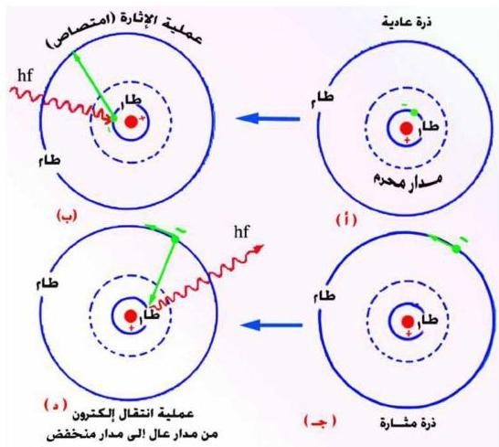

على شكل إشعاع له نفس التردد f شكل (١٤ د) . والمدار المنقط يمثل مدار محرم لا يجوز للإلكترون أن يتواجد فيه لأنه لا يفي بالفرضية الثانية لبوهر .

شكل (١٤)

# مبررات فرضيات بوهر :

١- إن مبرر الفرضية الأولى جاء منطقياً مع الواقع حيث، إن ذرة الهيدروجين ذرة مستقرة لا تبعث بأي إشعاع طالما لم تثر بأية طاقة خارجية .
٢- مبرر الفرضية الثانية أتى بعد زمن لاحق عندما اكتُشفت الطبيعة الموجية للإلكترون عام (١٩٢٦ م) على يد المهندس الفرنسي دي برولي .
٣- أما مبرر الفرضية الثالثة فأتى من فرضية التكميم لبلانك وهي تعبر أيضاً عن مبدأ حفظ الطاقة .

١٢٧

http://www.e-learning-moe.edu.ye/