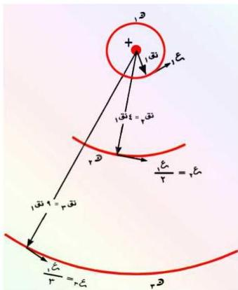

حتى إذا كانت ن = ∞
تكون ع = صفراً، وفي هذه
الحالة يكون الإلكترون خارج
الذرة وغير مرتبط بالنواة،
والشكل (١٥) يبين
القياسات النسبية للمدارات
dالدائرية للإلكترون
والسرعات المناظرة لها.
والطاقة الكلية (ط) ل
للإلكترون في مدار رقم (ن)
تُعطى بالعلاقة الآتية :

شكل (١٥)

$$ط_1 = - \frac{\sum_{i=1}^n \sum_{j=1}^n \frac{1}{n_i^2}}{n_i^2}$$

عندما ن = ١ يكون الإلكترون في المدار الأول وهو أدنى مستوى طاقة له

$$ط_2 = - \frac{\sum_{i=1}^n \sum_{j=1}^n \frac{1}{n_j^2}}{n_j^2}$$

الكميات التي تدخل في هذه العلاقة هي ثوابت طبيعية، فبتعويض قيمها
نجد قيمة ط1 التي تساوي:

$$ط_1 = - 13,6 \text{ إلكترون فولت (إ.ف)}$$

$$(حيث أن 1 \text{ إ.ف}) = 1,6 \times 10^{-19} \text{ جول})$$

وهذه القيمة النظرية تتفق مع القيمة التجريبية، ثم إن الإشارة السالبة التي
تظهر في العلاقة (١١) تعني، وفقاً للميكانيكا التقليدية، أن الإلكترون مرتبط
بالنواة في بئر جهد سالب.

١٣٠

http://www.e-learning-moe.edu.ye/