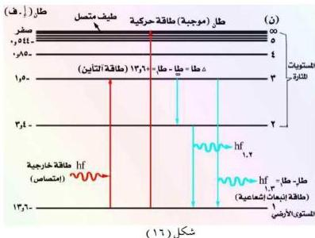

انظر الشكل (١٦). ونلاحظ من العلاقة (١١) أن طاقة الإلكترون (ط) سالبة (-) وتزداد جبرياً بازدياد العدد الكمي الرئيسي (ن) إلى أن تصل إلى الصفر عندها يتحرر

الإلكترون من مجال نواة الذرة وعندما: ن = ١ يكون الإلكترون في أدنى مستوى له في الطاقة ويسمى بالمستوى الأساسي (أو المستوى الأرضي) وتسمى المستويات الأخرى بالمستويات المشارية شكل (١٦). وكلما كبرت (ن) أي كلما ابتعد الإلكترون عن النواة ازدادت طاقته جبرياً حتى تصل إلى الصفر (ط = صفر) عند: ن = ∞، في هذه الحالة يكون الإلكترون حراً خارج الذرة وغير مرتبط بالنواة، ونقول عندئذ أن الذرة قد فقدت إلكتروناً لها وأصبحت متأينة. ومقدار الطاقة اللازمة لتأمين ذرة الهيدروجين، أي الطاقة التي يجب أن يمتصها الإلكترون في ذرة الهيدروجين لإخراج الإلكترون من المستوى الأرضي ط، الذي طاقته = (-١٣,٦) إلكترون فولت إلى خارج الذرة حيث ط = صفر هو:

ط = ط = (-١٣,٦) (إلكترون فولت) وهي تساوي طاقة المستوى الأرضي ولكن بإشارة موجبة، وتسمى هذه الطاقة، طاقة التأمين.

خارج الذرة تكون طاقة الإلكترون موجبة لأنها عبارة عن طاقة حركية. (حركة مستمرة) ويكون للإلكترون -نتيجة ذلك- طيف إشعاعي متصل، بينما داخل الذرة فطاقته مكممة كما صاغتها نظرية بوهر، وبالتالي فانتقاله داخلها يعطي طيفاً خطياً. الإلكترون الأكثر بعداً من النواة يمتلك طاقة أكبر فهو إذاً أكثر نشاطاً وفعالية، وهو المسؤول عن التفاعلات الكيميائية أو الإشعاعات الطيفية نتيجة لانتقاله

١٣٢

<http://www.e-learning-moe.edu.ye/>