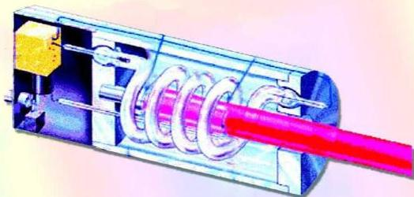

![LOGO]

# الإشعاع والمادة
Matter and Radiation

# الوحدة
السادسة

# أهداف الوحدة

يتوقع من الطالب بعد الانتهاء من دراسة هذه الوحدة أن يكون قادراً على أن:

١- يعرّف الظاهرة الكهروضوئية ويفسر حدوثها.
٢- يشرح بعضاً من مجالات تطبيقاتها في الحياة العملية.
٣- يعرّف الأشعة السينية ويذكر كيفية توليدها.
٤- يوضح المقصود بالطيف المميز والطيف المتصل للأشعة السينية ويفسر انبعاث كل منهما.
٥- يشرح بعض مجالات تطبيقاتها في الحياة العملية.
٦- يوضح المبادئ الأساسية لتوليد أشعة الليزر.
٧- يصف تركيب جهاز ليزر الياقوت.
٨- يشرح كيفية عمل جهاز ليزر الياقوت.
٩- يوضح بعضاً من استخدامات أشعة الليزر في الحياة العملية.
١٠- يحل مسائل حسابية مرتبطة بالإشعاع والمادة.

١٤٤

http://www.e-learning-moe.edu.ye/