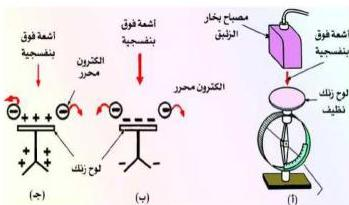

شكل (١)

٤- ضع لوح الزجاج على لوح الزنك وراقب ورقتي الكشاف، ماذا تلاحظ؟ إعط تفسيراً لملاحظاتك؟

٥- اشحن لوح الزنك بشحنة موجبة وكرر نفس الخطوات السابقة

وراقب ورقتي الكشاف الكهربائي هل يظل انفراجها ثابتاً؟ علام يدل عدم انطباقهما؟ ماذا تستنتج من ذلك؟ انظر الشكل (١ ج).

# ملخص الاستنتاجات:

- في حالة إذا كان لوح الزنك مشحوناً بشحنة سالبة فإن انفراج ورقتي الكشاف الكهربائي يقل ثم تنطبقان على بعضهما، والسبب هو أنه عندما يسقط الضوء على سطح معدن الزنك تنطلق منه الإلكترونات سالبة الشحنة (الإلكترونات الضوئية) مما يؤدي إلى تفريغ الكشاف من شحنته السالبة ويصبح متعادل الشحنة فتطبق الورقتان على بعضهما.
- أما إذا شُحن سطح الزنك بشحنة موجبة فإن شحنته تزداد إيجابية عند سقوط الضوء عليه مما يبقى ورقتي الكشاف على انفراجهما.
- وإذا وضع لوح زجاجي على سطح معدن الزنك فإن اللوح الزجاجي يمتص الأشعة فوق البنفسجية الساقطة عليه، ويمنعها من الوصول إلى سطح معدن الزنك، الأمر الذي يمنع حدوث الظاهرة الكهروضوئية.

# الخلية الكهروضوئية:

هناك أنواع عديدة من الخلايا الكهروضوئية، ومنها ما هو مبين في الشكل (٢). وتتكون من أنبوب أو انتفاخ من الكوارتز مفرغ من الهواء (لماذا؟) ويحوي داخله صفيحة معدنية مقعرة حساسة للضوء تدعى المهبط (C). هذه الصفيحة تكون باعثة للإلكترونات الضوئية عند سقوط ضوء عليها بتردد مناسب، يقابلها قضيب معدني رفيع (حتى لا يحجب الضوء الساقط على المهبط) يوضع في مركز تكرر الصفيحة المقعرة (لماذا؟) ويدعى المصعد (A).

١٤٦

http://www.e-learning-moe.edu.ye/