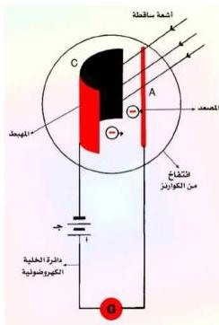
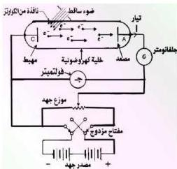

شكل (٢)

شكل (٣)

ويكون مجمعاً للإلكترونات المنبعثة من صفيحة المهبط. هذا الجهاز يسمى بالخلية الكهروضوئية. إذا وصل مصعد الخلية (A) على التوالي، مع جلفانومتر (G) وبالقطب الموجب لمصدر جهد كهربائي (ج) (بطارية) ثم ربط القطب السالب للجهد بمهبط الخلية (C)، فإن هذه الدائرة تسمى بدائرة الخلية الكهروضوئية شكل (٢).

عندما يُسلط ضوء بتردد مناسب على صفيحة المهبط (C) يؤدي ذلك إلى انبعاث إلكترونات ضوئية يلتقطها المصعد الموجب (A)، وبالتالي إلى مرور تيار بدائرة الخلية يدل عليه انحراف مؤشر الجلفانومتر (G). أما إذا حجب سقوط الضوء عن صفيحة المهبط فستلاحظ عدم انحراف مؤشر الجلفانومتر مما يدل على عدم مرور تيار كهربائي بدائرة الخلية وذلك بسبب توقف انبعاث الإلكترونات من سطح المهبط.

## تجربة مليكان لدراسة الظاهرة الكهروضوئية :

لقد قام العالم الأمريكي روبرت مليكان عام ١٩١٦م بدراسة تجريبية وافية للظاهرة الكهروضوئية وتحقق من تفسير إنشائيين لها. ويبين الشكل (٣) مخطط

الجهاز الذي استخدمه لدراسة هذه الظاهرة. وتظهر على جدار الأنبوب الزجاجي للجهاز نافذة من الكوارتز يتم إسقاط الضوء من خلالها، لأن الزجاج العادي يمتص الأشعة فوق البنفسجية، بينما يسمح الكوارتز بمرورها.

١٤٧

http://www.e-learning-moe.edu.ye/