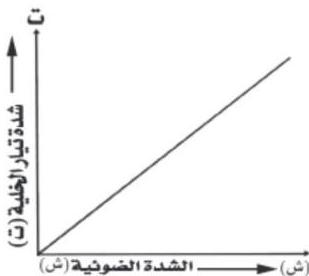

# خطوات التجربة ونتائجها :

١ - دراسة العلاقة بين شدة تيار الخلية (ت) وشدة الضوء الساقط (ش) :
يُثَبَّت فرق الجهد (ج) بين المهبط (C) والمصعد (A)، وكذلك تردد الضوء (باستخدام مرشح ضوئي معين)، أي أن يكون الضوء الساقط على المهبط وحيد اللون. فإذا تغيرت الشدة الضوئية الساقطة (ش) - وذلك يجعل المصدر الضوئي (المصباح) على مسافات مختلفة من سطح المهبط - فإن شدة تيار الخلية الكهروضوئية (ت) تزداد طردياً مع زيادة الشدة الضوئية (ش) الساقطة على الخلية. والشكل (٤) يبين هذا التناسب.

# ٢ - دراسة العلاقة بين شدة

# التيار (ت) وفرق

# الجهد (ج) :

يُثَبَّت تردد الضوء الساقط (f)، وكذلك شدته الضوئية (ش)، وذلك بوضع المصدر الضوئي على بعد ثابت من مهبط الخلية الكهروضوئية، وتدرس العلاقة بين فرق

شكل (٤)

جهد (ج) الخلية الكهروضوئية وشدة تيارها (ت). فعندما يسقط الضوء على السطح المعدني للمهبط (C) تنبعث الإلكترونات الضوئية منه، وإذا كان جهد المصعد (A) موجباً بالنسبة للمهبط (C) فإن الإلكترونات المنبعثة من المهبط تنطلق نحو المصعد الموجب مسببة بذلك مرور تيار كهربائي (ت) يدل على مقدار شدته انحراف مؤشر الجلفانومتر. وتزداد شدة التيار (ت) بازدياد فرق الجهد (ج) حتى تصل شدة التيار إلى قيمة ثابتة لا تتغير بعدها مهما زاد جهد المصعد، لأن المجال الكهربائي بين المصعد والمهبط يصبح كافياً لجذب كل الإلكترونات المنبعثة من المهبط،

١٤٨

http://www.e-learning-moe.edu.ye/