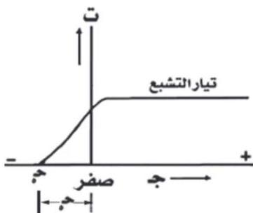

شكل (٥)

وأي زيادة في جهد المصعد لا تؤدي إلى وصول مزيد من الإلكترونات إلى المصعد، وتسمى قيمة التيار عندها بتيار التشبع. وإذا قللنا فرق الجهد بين المصعد والمهبط حتى الصفر تنخفض شدة التيار بالتدريج ولكنها لا تنعدم عندما يكون فرق الجهد صفراً، انظر الشكل (٥).

ويعني ذلك أن الضوء الساقط على المهبط لا يكتفي بتحرير الإلكترون من سطح المعدن فحسب، بل ويعد بعضها (بالإضافة إلى تحريرها) بطاقة حركية تمكنها من الوصول إلى المصعد. وعندما يعكس توصيل موزع الجهد بواسطة المفتاح المزدوج في شكل (٣) بحيث يتصل المهبط بالقطب الموجب لموزع الجهد والمصعد بالقطب السالب، تلاحظ تناقص شدة التيار بزيادة فرق الجهد السالب (-ج)، بسبب تنافر الإلكترونات المنطلقة من المهبط مع المصعد السالب، ولا تصل إليه إلا تلك الإلكترونات التي طاقتها الحركية ($\frac{1}{2}$ كغ) أكبر من الطاقة الكهربائية ج س م (حيث ع سرعة الإلكترون، ك كتلته و س م شحنته). وعندما يصبح فرق الجهد السالب قادراً على منع أسرع هذه الإلكترونات من الوصول إلى المصعد، تنعدم شدة التيار المار في دائرة الخلية، ويسمى عندئذ هذا الجهد (ج) بجهد الإيقاف ونرمز له بالرمز (ج). وتكون الطاقة الكهربائية المناظرة لهذا الجهد (ج س م) مساوية للطاقة الحركية ($\frac{1}{2}$ كغ) لأسرع الإلكترونات.

وهي الطاقة العظمى (طغ) لحركة الإلكترونات. أي إن:

$$طغ = \frac{1}{2} كغ = ج س م \dots\dots\dots (1)$$

١٤٩

http://www.e-learning-moe.edu.ye/