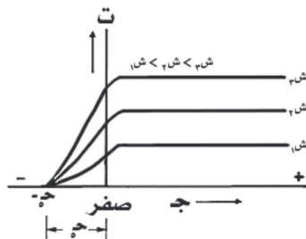
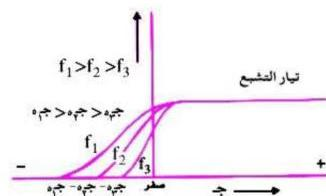

من هذه العلاقة يمكن تعيين سرعة وطاقة حركة أسرع الإلكترونات وتسمى العلاقة البيانية في الشكل (٥) بين فرق جهد الخلية وشدة تيارها (ت) عند شدة ضوئية معينة (ش) بالمنحنى المميز للخلية.

٣ - دراسة علاقة جهد الإيقاف (ج) بشدة الضوء الساقط على الخلية (ش) :
إذا استخدم نفس الضوء ولكن أسقطناه بثلاث شدات مختلفة (بأن نجعل المصباح الضوئي على مسافات مختلفة من المهبط) نحصل على نفس جهد الإيقاف (ج) ولكن بتيارات تشبع مختلفة تتناسب قيمة كل منها مع الشدة الضوئية الساقطة ، انظر الشكل (٦) .

شكل (٦)

وهذا يعني أن القيمة العظمى للطاقة الحركية للإلكترونات الضوئية المنبعثة من سطح المهبط لا تتعلق بالشدة الضوئية كما يوضحه الشكل (٦) والمعادلة (١) .

٤ - دراسة علاقة تردد الضوء الساقط بجهد الإيقاف (ج) :

إذا ثبتت الشدة الضوئية فإن القيمة العظمى للطاقة الحركية للإلكترونات المنبعثة تعتمد على تردد الضوء الساقط، ويتضح ذلك من الشكل (٧) الذي يبين أن جهد الإيقاف (ج) يختلف باختلاف تردد الضوء الساقط وكذلك الطاقة الحركية

شكل (٧)

١٥٠

http://www.e-learning-moe.edu.ye/