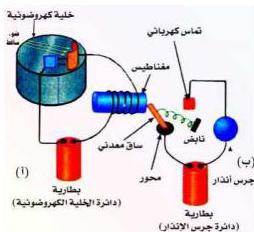
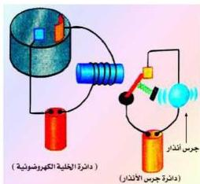

## استخدامات الخلية الكهروضوئية :

يستفاد من دائرة الخلية الكهروضوئية في كثير من الاستخدامات العملية، فهي تستخدم بشكل رئيسي كمفتاح ضمن دائرتها لدائرة كهربية أخرى. فعلى سبيل المثال - دائرة جرس الإنذار ضد اللصوص كما هو مبين مخططها في الشكل (١٠) حيث توجد دائرتان: الأولى دائرة الخلية الكهروضوئية تحوي خلية كهروضوئية، بطارية، ومغناطيس كهربائي، شكل (١٠ أ)، والدائرة الثانية هي دائرة جرس الإنذار وتتكون من ساق معدني يتحرك حول محور ثابت مربوط بنابض حلزوني، بطارية، جرس إنذار وتماس كهربائي شكل (١٠ ب).

تضاء عادة الخلية الكهروضوئية في أجهزة أجراس الإنذار بحزمة ضوئية غير مرئية من الأشعة فوق البنفسجية التي تؤدي إلى نشوء تيار كهربائي في دائرة الخلية، ينتج عنه تفتنط المغناطيس الكهربائي الذي بدوره يجذب إليه الساق المعدنية للدائرة الثانية، دائرة جرس الإنذار، فيؤدي إلى فتحها شكل (١٠ ب).

وعند اعتراض جسم أو شخص طريق الأشعة ينعدم تيار الخلية الكهروضوئية وبالتالي يزول تفتنط المغناطيس ويصبح من السهل على النابض الحلزوني جذب الساق المعدنية من المغناطيس إلى التماس الكهربائي في دائرة الجرس كما هو مبين في الشكل (١١) مما يؤدي إلى إغلاقها وإصدار صوت للجرس.

ومن الاستخدامات الأخرى للخلية الكهروضوئية، مقياس شدة الإضاءة في آلات التصوير، وفتح الأبواب تلقائياً في الفنادق والمستشفيات الكبيرة وغيرها من

البنايات الحديثة، وكذلك إضاءة أنوار الشوارع بطريقة آلية عند غروب الشمس، وإطفائها عند الشروق.

شكل (١٠)

شكل (١١)

١٥٦

<http://www.e-learning-moe.edu.ye/>