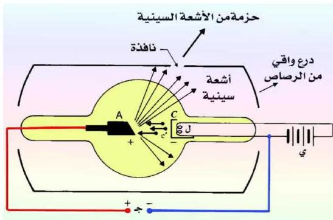

## الأشعة السينية :

اكتشف العالم الألماني رونتجن بطريق الصدفة عام ١٨٩٥م أنه عندما تصطدم حزمة من الإلكترونات – أو من أية جسيمات مشحونة ذات طاقة حركية كبيرة – بسطح فلزي ثقيل موجود داخل أنبوب مفرغ من الهواء ، فإنه تنبعث من الفلز أشعة ذات طاقة عالية ( تردد عال ، وطول موجي قصير ) . وكانت طبيعة هذه الأشعة في البداية غير معروفة فأطلق عليها العالم رونتجن اسم الأشعة السينية مثلما يستخدم الرمز ( س ) لتمثيل أي مجهول في الجبر . ونحن نعلم الآن بأنها عبارة عن إشعاع كهرومغناطيسي أطوال موجاته تتراوح بين ( ١ ، ١٠٠ ) أنجستروم .

يتم توليد الأشعة السينية في المختبر بواسطة أنبوب زجاجي مفرغ من الهواء تقريباً يسمى أنبوب الأشعة السينية ، ويحوي هذا الأنبوب عند أحد طرفيه مهبطاً ( C ) باعثاً للإلكترونات يسخن بشكل غير مباشر بواسطة فتيل ( ل ) موصل ببطارية ( ي ) . وفي طرفه الآخر مصعد ( A ) من فلز ثقيل صلب مثل ( عنصر التنجستن ) . يسلط بين طرفي الأنبوب فرق جهد ( ج ) عال تتراوح قيمته بين ( ١٠ - ١٠ ) فولت ، كما هو مبين في الشكل ( ١٢ ) .

شكل ( ١٢ )

١٥٧

http://www.e-learning-moe.edu.ye/