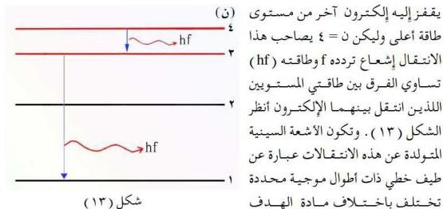

تُعجَّل الإلكترونات المنبعثة من المهبط (C) عبر الأنبوب المفرغ بواسطة فرق الجهد العالي (ج) المطبق بين طرفيه، وتصطدم بالهدف (مادة المصعد (A)) بسرعة عالية (ع)، وينتج عن هذا التصادم انبعاث إشعاع ذي ترددات عالية في كل الاتجاهات يُسمى بالأشعة السينية.

هذه الأشعة ذات نفاذية كبيرة، بسبب طاقتها العالية، فهي خطرة على الصحة ولهذا يحاط عادة أنبوب الأشعة السينية بدرجة واق من الرصاص لحماية الباحثين أو العاملين من التعرض لهذه الأشعة. وتُوجه الحزمة المطلوبة من هذه الأشعة بدقة من خلال نافذة صغيرة على هذا الدرع. انظر الشكل (١٢).

### تفسير سبب انبعاث الأشعة السينية:

يمكن تفسير انبعاث الأشعة السينية بالاعتماد على نموذج بوهر الذري، إذ تتفاعل الإلكترونات المصطدمة بالهدف مع مادته ويحدث أحد الاحتمالين أو كلاهما.

الاحتمال الأول: تنفذ بعض الإلكترونات ذات الطاقة العالية داخل ذرات مادة الهدف مخترقة مداراتها الإلكترونية فتصطدم بأحد إلكتروناتها الداخلية، أي بأحد مستويات الطاقة القريبة من النواة (المناظرة لـ ١ = ١ مثلاً)، فيؤدي ذلك إلى اقتلاعه من مستوى الطاقة الخاص به تاركاً وراءه فراغاً، ما يلبث أن يقفز إليه إلكترون آخر من مستويات الطاقة العليا (البعيدة عن النواة وليكن ن = ٣) ليملأ هذا الفراغ وينتج عن ذلك إشعاع تردده f وطاقته (hf) تساوي الفرق بين طاقتي المستويين اللذين انتقل بينهما الإلكترون. وهذا الإلكترون الأخير يترك بدوره فراغاً عند انتقاله

١٥٨

http://www.e-learning-moe.edu.ye/