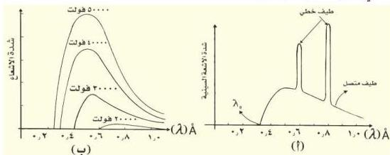

وتكون مميزة لمادته، لأن لكل عنصر مستويات طاقة خاصة به. ولهذا تسمى هذه الإشعاعات بالأشعة السينية المميزة، أنظر الشكل (١٤ أ). حيث يظهر عليه الطيف الخطي المميز لعنصر التنجستن.

شكل (١٤)

الاحتمال الثاني : بعض الإلكترونات المعجلة (المتسارعة) تواصل سيرها داخل ذرات الهدف دون الاصطدام بإلكتروناتها، ولكنها تتأثر بمجالها الكهربائي فتتباطأ وتتناقص سرعتها نتيجة لتنافسها مع إلكترونات ذرات الهدف، فتقل طاقتها الحركية بشكل مستمر، ويظهر النقص في طاقتها على شكل إشعاع تردده يتناقص باستمرار مع استمرار تباطؤ الحركة فينتج عن ذلك إشعاع ذو طيف متصل يحوي جميع الترددات (أي جميع الأطوال الموجية)، أنظر الشكل (١٤ ب). وقد يفقد الإلكترون المقذوف كل طاقته الحركية ($\frac{1}{2} \text{ك} \text{ع} \text{ع}^2$) دفعة واحدة وعندئذ تكون طاقة الإشعاع المنبعث ($\text{hf}$) ذي التردد ($\text{f}$) مساوية تماماً للطاقة الحركية التي فقدها الإلكترون أي إن:

$$\text{hf} = \frac{1}{2} \text{ك} \text{ع} \text{ع}^2 \quad \dots \dots \dots \dots \dots \dots \dots \dots \dots \dots \dots \dots \dots \dots \dots \dots \dots \dots \dots \dots \dots \dots \dots \dots \dots \dots \dots \dots \dots \dots \dots \dots \dots \dots \dots \dots \dots \dots \dots \dots \dots \dots \dots \dots \dots \dots \dots \dots \dots \dots$$

$$\text{وبما أن : } \frac{1}{2} \text{ك} \text{ع} \text{ع}^2 = \text{ج} \text{س} \text{م} \quad \dots \dots \dots \dots \dots \dots \dots \dots \dots \dots \dots \dots \dots \dots \dots \dots \dots \dots \dots \dots \dots \dots \dots \dots \dots \dots \dots \dots \dots \dots \dots \dots \dots \dots \dots \dots \dots \dots \dots \dots \dots \dots \dots \dots \dots \dots \dots \dots \dots \dots$$

حيث ج هو فرق الجهد المطبق بين طرفي أنبوبة الأشعة السينية، س م هي شحنة الإلكترون فمن العلاقتين (٤)، (٥) نجد أن:

$$\text{hf} = \text{ج} \text{س} \text{م} \quad \dots \dots \dots \dots \dots \dots \dots \dots \dots \dots \dots \dots \dots \dots \dots \dots \dots \dots \dots \dots \dots \dots \dots \dots \dots \dots \dots \dots \dots \dots \dots \dots \dots \dots \dots \dots \dots \dots \dots \dots \dots \dots \dots \dots \dots \dots \dots \dots \dots \dots$$

$$\therefore \text{f} = \frac{\text{س}}{\text{h}} \text{ج} \quad \dots \dots \dots \dots \dots \dots \dots \dots \dots \dots \dots \dots \dots \dots \dots \dots \dots \dots \dots \dots \dots \dots \dots \dots \dots \dots \dots \dots \dots \dots \dots \dots \dots \dots \dots \dots \dots \dots \dots \dots \dots \dots \dots \dots \dots \dots \dots \dots \dots \dots$$

١٥٩

http://www.e-learning-moe.edu.ye/