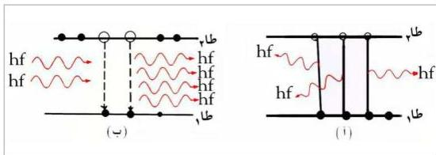

## ٢- الإنبعاث التلقائي : (Spontaneous Emission)

ولكن سرعان ما تعود الذرة المثارة تلقائياً من المستوى المثار (طأ) إلى حالتها الأرضية ويحدث ذلك عندما تعود إلكتروناتها إلى مستواها السابق (طأ) باعثة بالطاقة التي امتصتها على شكل شعاع ضوئي، أي فوتون له نفس تردد الفوتون الساقط (f). أما طوره واتجاهه فغير محددين. تسمى هذه العملية بالإنبعاث التلقائي شكل (أ ب).

## ٣- الإنبعاث المستحث : (Induced or Stimulated Emission)

في الحقيقة أن الذرات المثارة يمكن أن تعود إلى حالتها المستقرة (إلى المستوى الأرضي طأ) بعمليتين مختلفتين :

إما تلقائياً وهو الشيء الذي ذكرناه، وفي هذه العملية التلقائية تعود الذرات إلى المستوى الأرضي بشكل عشوائي باعثة إشعاعاتها في كل الاتجاهات، لأن كل ذرة من ملايين الذرات تبعث بأشعتها مستقلة عن الذرات الأخرى، فتكون الأشعة المنبعثة غير مترابطة، شكل (أ ب)، وهذا الإنبعاث هو الإنبعاث الطبيعي للذرات الذي يحدث في المنابع الضوئية الطبيعية أو في المصابيح الكهربائية.

شكل (١٦)

١٦٥

http://www.e-learning-moe.edu.ye/